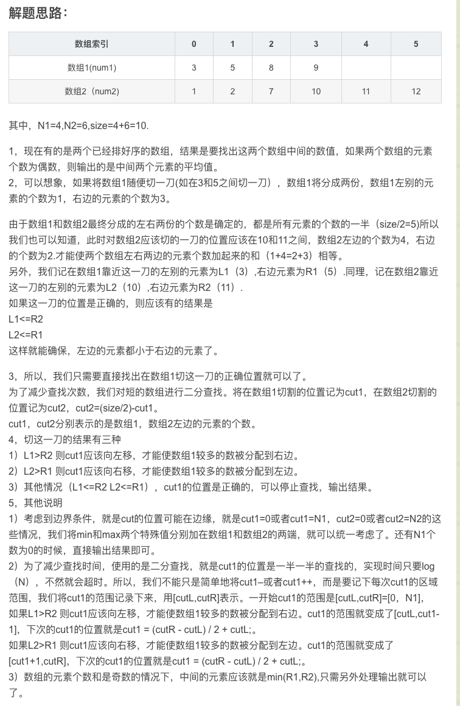

# [LeetCode 4. Median of Two Sorted Arrays](https://leetcode-cn.com/problems/median-of-two-sorted-arrays/)

## Methods

### Method 1

* `Time Complexity`: log(min(m, n)); m和n分别为两个数组的长度
* `Space Complexity`:
* `Intuition`:
* `Key Points`:

数组长度n为奇数, 中间的左边为 (n - 1) / 2 或 n // 2
数组长度n为偶数, 中间的左边为 (n - 1) // 2 和 n / 2

总结可为:
数组长度为奇数或偶数时候, 其中间数的平均值为
((n - 1) // 2 + n // 2) // 2

* `Algorithm`:



### Code1

* `Code Design`:

```java
public static double findMedianSortedArrays(int[] nums1, int[] nums2) {
        int MIN_VALUE = 0x80000000;

        int MAX_VALUE = 0x7fffffff;

        int N1 = nums1.length;
        int N2 = nums2.length;
        if (N1 > N2) {// 确保N1是短的部分。
            return findMedianSortedArrays(nums2, nums1);
        }

        if (N1 == 0)
            return ((double) nums2[(N2 - 1) / 2] + (double) nums2[N2 / 2]) / 2; // 不管奇数偶数都成立
        int size = (N1 + N2);
        int cutL = 0, cutR = N1;
        int cut1 = N1 / 2;
        int cut2 = size / 2 - cut1;

        while (cut1 <= N1) {
            cut1 = (cutR - cutL) / 2 + cutL;
            cut2 = size / 2 - cut1;

            double L1 = (cut1 == 0) ? MIN_VALUE : nums1[cut1 - 1];
            double L2 = (cut2 == 0) ? MIN_VALUE : nums2[cut2 - 1];
            double R1 = (cut1 == N1) ? MAX_VALUE : nums1[cut1];
            double R2 = (cut2 == N2) ? MAX_VALUE : nums2[cut2];
            if (L1 > R2)
                cutR = cut1 - 1;
            else if (L2 > R1)
                cutL = cut1 + 1;
            else {// Otherwise, that's the right cut.
                if (size % 2 == 0) {// 偶数个数的时候
                    L1 = (L1 > L2 ? L1 : L2);
                    R1 = (R1 < R2 ? R1 : R2);
                    return (L1 + R1) / 2;
                }

                else {
                    R1 = (R1 < R2 ? R1 : R2);
                    return R1;
                }
            }
        }
        return -1;
    }

```

## Reference1

[youtube](https://www.youtube.com/watch?v=do7ibYtv5nk)
[blog](https://www.youtube.com/watch?v=do7ibYtv5nk)
