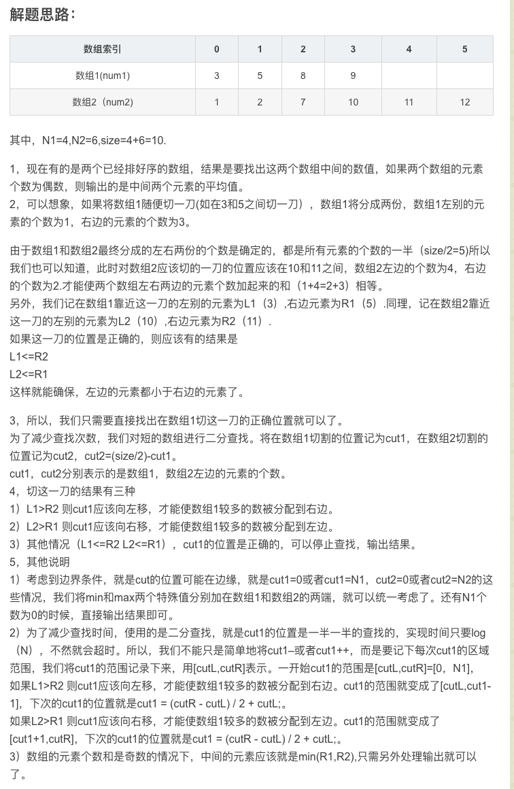

# [LeetCode 4. Median of Two Sorted Arrays](https://leetcode-cn.com/problems/median-of-two-sorted-arrays/)

## Methods

### Method 1

* `Time Complexity`: log(min(m, n)); m和n分别为两个数组的长度
* `Space Complexity`:
* `Intuition`:
* `Key Points`:

数组长度n为奇数, 中间的左边为 (n - 1) / 2 或 n // 2
数组长度n为偶数, 中间的左边为 (n - 1) // 2 和 n / 2

总结可为:
数组长度为奇数或偶数时候, 其中间数的平均值为
((n - 1) // 2 + n // 2) // 2

* `Algorithm`:



### Code1

* `Code Design`:

```python
class Solution:
    def findMedianSortedArrays(self, nums1, nums2):
        MIN_VALUE = float('-inf')
        MAX_VALUE = float('inf')

        N1 = len(nums1)
        N2 = len(nums2)
        
        if N1 > N2:  # Ensure nums1 is the smaller array
            return self.findMedianSortedArrays(nums2, nums1)

        if N1 == 0:
            return (nums2[(N2 - 1) // 2] + nums2[N2 // 2]) / 2  # Handle case for an empty nums1

        size = N1 + N2
        start, end = 0, N1

        cutA = 0 # nums1的cut
        cutB = 0 # nums2的cut
        while start <= end:
            cutA = (start + end) // 2
            cutB = size // 2 - cutA

            L1 = MIN_VALUE if cutA == 0 else nums1[cutA - 1]
            L2 = MIN_VALUE if cutB == 0 else nums2[cutB - 1]
            R1 = MAX_VALUE if cutA == N1 else nums1[cutA]
            R2 = MAX_VALUE if cutB == N2 else nums2[cutB]

            if L1 > R2:
                end = cutA - 1
            elif L2 > R1:
                start = cutA + 1
            else:  # We have found the correct cut
                if size % 2 == 0:  # Even total length
                    L1 = max(L1, L2)
                    R1 = min(R1, R2)
                    return (L1 + R1) / 2
                else:  # Odd total length
                    R1 = min(R1, R2)
                    return R1
        return -1

```

## Reference1

[youtube1](https://www.youtube.com/watch?v=ScCg9v921ns&t=15s)
[youtube2](https://www.youtube.com/watch?v=do7ibYtv5nk)
