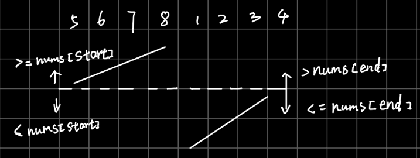

# 33. Search in Rotated Sorted Array    

[LeetCode 33](https://leetcode.com/problems/search-in-rotated-sorted-array/)


## Methods

### Method 1
the common binary search method, we get `mid` then move `left` or `right` base `mid` and `target`. 
But in this problem, every time we get `mid`, we need to judge it is on left part or right part, then compare 
`target` with  `nums[start]` , `nums[end]` and `nums[mid]` to get the exact position of `target`.


### Key Points


### Code
```java
class Solution {
    public int search(int[] nums, int target) {
        if (nums.length == 0) return -1;
        
        int start = 0 , end = nums.length -1;
        while (start + 1 < end){
            int mid = start + (end - start) / 2;

            // mid in left part
            if (nums[start] <= nums[mid]){   // if (nums[end] <= nums[mid] is also right;
                if (nums[start] <= target && target <= nums[mid]) end = mid; // target is at left of mid
                else start = mid;
            // mid in left part
            }else{
                if (nums[mid] <= target && target <= nums[end]) start = mid; // target is at right of mid
                else end = mid;
            }
        }
        if (nums[start] == target) return start;
        if (nums[end] == target) return end;
        return -1;
    }

    public int search1(int[] nums, int target) {
        if (nums.length == 0) return -1;
        
        int start = 0 , end = nums.length -1;
        while (start + 1 < end){
            int mid = start + (end - start) / 2;

            // mid in right part
            if (nums[end] >= nums[mid]){             // if (nums[start] > nums[mid] is also right;
                if (nums[mid] <= target && target <= nums[end]) start = mid; // target is at right of mid
                else end = mid;
            // mid in left part
            }else{
                if (nums[start] <= target && target <= nums[mid]) end = mid; // target is at left of mid
                else start = mid;
            }
             
        }
        if (nums[start] == target) return start;
        if (nums[end] == target) return end;
        return -1;
    }

}

```


## Reference