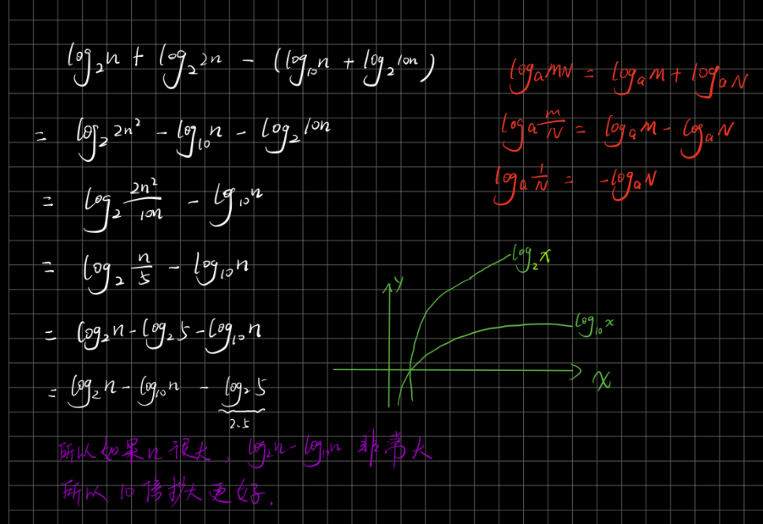

# [LeetCode 702. Search in a Sorted Array of Unknown Size](https://leetcode-cn.com/problems/search-in-a-sorted-array-of-unknown-size/)

## Methods

### Method 1

* `Time Complexity`:
* `Space Complexity`:
* `Intuition`:
* `Key Points`:
* `Algorithm`:

无限大, 就让`right`每次扩大2倍, 或者10倍? 由此引出来一个问题, right扩大多少倍最好?

如果一个数组长n,则:

1. 假设跳出这个数组需要`x`次, 则2倍时候需要 `2^x = n`, 10倍时候需要`10^x = n`.
2. 跳出数组后, 要往回找到答案. 假设倒数第二次没跳出来数组, 在第`n-1`的位置上, 则下次一定跳出来数组, 所以跳出数组后, 所在位置是`2n`或`10n`. 因为是二分法, 从数组外面跳进去, 都要2倍的递减. 假设最糟糕时候target在首位, 找到答案需要`x`次, 则2倍时候,`2^x = 2n`; 10倍时候`2^x = 10n`

所以

```
                            2 倍移动                         10 倍移动
time to jump out:         x = log2(n)                      x = log10(n)
time to jump in:          x = log2(2n)                     x = log2(10n)
```

相减

```
2倍移动 - 10倍移动 =  log2(n) + log2(2n) - (log10(n) + log2(10n)) =
```



所以基本上n很大时候, 10倍扩大更好

### Code1

* `Code Design`:

```python
class Solution:
    def search(self, reader, target):
        """
        :type reader: ArrayReader
        :type target: int
        :rtype: int
        """

        left, right = 0, 1
        while reader.get(right) < target:
            right = right * 10 # 这里10倍扩大耗时远比2倍扩大小的多
        if reader.get(right) == target:
            return right

        while left + 1 < right:
            mid = (left + right) // 2
            if reader.get(mid) == target:
                return mid
            elif reader.get(mid) < target:
                left = mid
            else:
                right = mid

        if reader.get(left) == target:
            return left
        elif reader.get(right) == target:
            return right

        return -1
```

## Reference1

