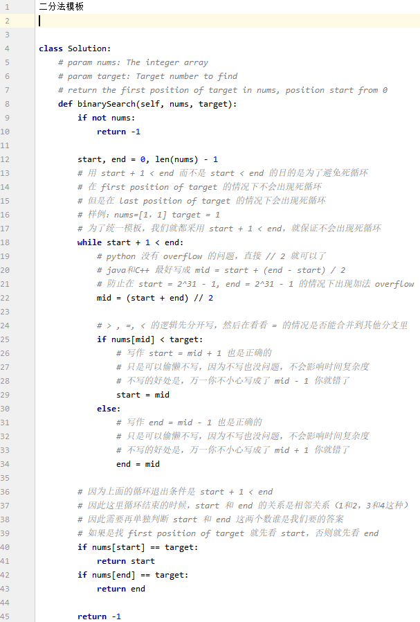

# 二分法技巧

## 模板

## 数组减一问题

输入一个数组和一个整数k. 数组里面每个元素表示某个东西的数量，例如`[5, 2, 3, 4]`表示东西`i=1`有5个，`i=2`有2个，`i=3`有3个，`i=4`有4个。要求将每k个不同种类的东西一组, 每个种类东西只有一个。可以最多分多少组？

例如， 上述例子中， 假设我有4种类型的视频，每种类型的视频有5个，2个，3个和4个。我想将每`k = 3`个不同类型的视频放在一组，每个类型的视频只能放一个。我可以最多放多少组？

答案：

先想到的是用heap模拟的方法，通过每次取出 k 个剩余视频最多的种类，递减后再放回堆中，直到无法再凑齐一组，这种方法能够正确地模拟“每组 k 个不同种类，每种只能用一个”的要求。不过在实际应用中需注意效率问题，特别是当输入规模较大时。
时间复杂度是`O(G × log(n))`，其中 G 是最终形成的组数，n 是视频种类数。

有没有更简单的方法？

答案就是二分法：

