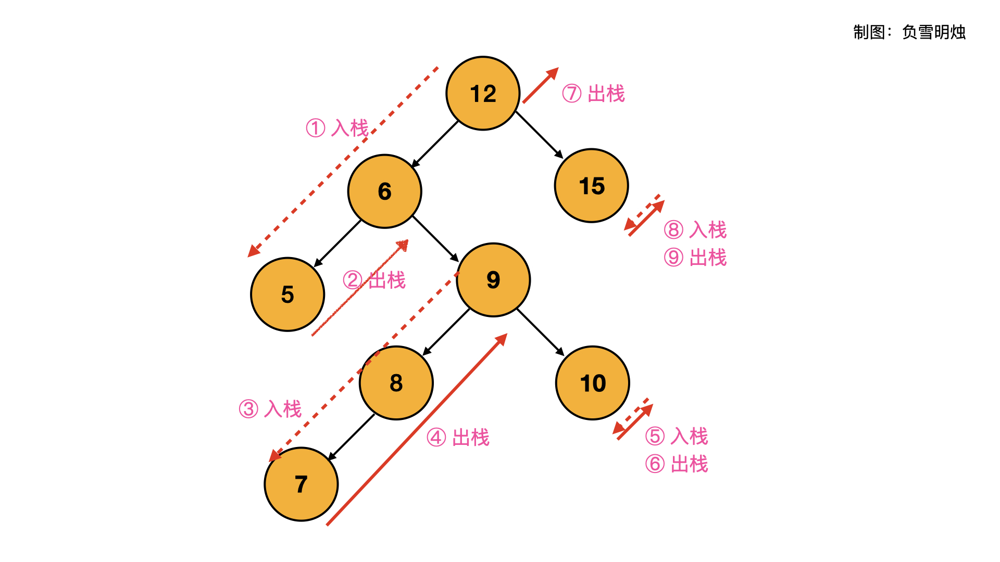

# [LeetCode 173. Binary Search Tree Iterator](https://leetcode-cn.com/problems/binary-search-tree-iterator/)

## Methods

### Method 1

* `Time Complexity`:
* `Space Complexity`:
* `Intuition`: DFS + array
* `Key Points`:
* `Algorithm`:

中序遍历, 存到数组里面, 然后每次遍历数组的指针往后移动一位就行. 但这不是最好的答案, 因为空间复杂度较大和时间复杂度一开始初始化时候都是O(n)

----------------------

### Method 2

* `Time Complexity`:
* `Space Complexity`: 要求O(h)的空间复杂度，h为tree的高度
* `Intuition`: stack非递归形式
* `Key Points`:
* `Algorithm`:

`stack`存的值基本都是比当前节点`cur`值大的节点(其实不是很准确, 存的是比当前节点`cur`都大的部分节点, 可以借助这些stack存的部分节点遍历得到所有比当前`cur`大的所有节点



### Code2

* `Code Design`:

```python
class BSTIterator(object):
    def __init__(self, root):
        self.stack = []
        while root:
            self.stack.append(root)
            root = root.left

    def next(self):
        cur = self.stack.pop()
        node = cur.right
        while node:
            self.stack.append(node)
            node = node.left
        return cur.val

    def hasNext(self):
        return len(self.stack) > 0
```

## Reference2

[leetcode ans](https://leetcode-cn.com/problems/binary-search-tree-iterator/solution/fu-xue-ming-zhu-dan-diao-zhan-die-dai-la-dkrm/)

----------------------

### Method 3

* `Time Complexity`:
* `Space Complexity`: 要求O(h)的空间复杂度，h为tree的高度
* `Intuition`: stack非递归形式, 其实和`method2`没什么区别, 就是代码有点区别
* `Key Points`:
* `Algorithm`:

每次get要求从小到大，所以stack从先push大的值再push较小的值

观察BST的特点，如果当前节点没有右儿子，那它就是最大的节点，把它先push进stack然后沿着左儿子都push进去，这样get函数就可以直接pop最顶层的stack得到。

如果有右儿子，那他不是最大的值，要把它右儿子push进去，然后看看它右儿子有没有右儿子

这样stack里面要么只有从当前节点的左儿子到叶子节点的所有节点，要么当前节点的右儿子以及右儿子的左儿子到叶子节点的所有节点，空间复杂度得到了保证

方法有了，代码怎么实现呢？

用了指针,先把所有root到左叶子节点加进去

每次pop时候，才往stack加pop的右节点的所有左儿子

### Code3

* `Code Design`:

```java
package LeetCode_Java.DFS.Binary_Search_Tree_Iterator;
import java.util.LinkedList;

public class Binary_Search_Tree_Iterator {

    //LeetCode_Java.buildinClass.TreeNode
    public class TreeNode {
        public int val;
        public TreeNode left, right;
        public TreeNode(int val) {
            this.val = val;
            this.left = this.right = null;
        }
    }

    LinkedList<TreeNode> stack;


    public Binary_Search_Tree_Iterator(TreeNode root) {
        stack = new LinkedList<>();
        while (root != null){
            stack.add(root);
            root = root.left;
        }
    }

    /*
     * @return: True if there has next node, or false
     */
    public boolean hasNext() {
        // write your code here
        return !stack.isEmpty();
    }

    /*
     * @return: return next node
     */
    public TreeNode next() {
        // write your code here
        TreeNode node = stack.removeLast();

        TreeNode nodeRight = node.right;
        while(nodeRight != null){
            stack.add(nodeRight);
            nodeRight = nodeRight.left;
        }

        return node;
    }
}
```

## Reference3
