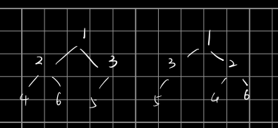

# [LeetCode 951. Flip Equivalent Binary Trees](https://leetcode-cn.com/problems/flip-equivalent-binary-trees/)

## Methods

### Method 1

* `Time Complexity`: 这是个四叉树
* `Space Complexity`:
* `Intuition`:
* `Key Points`:
* `Algorithm`:

该题前置题目需要掌握: [symmetric tree](DFS/Symmetric_Tree)

这道题最重要的是理解题意: 任意选择某个node, 然后交换他的左右子树, 则这两个树是`flip equivalent tree`

我们从两个树的root开始遍历, 判定两个树是`flip equivalent tree`呢? 我们先通过图观察下列`flip equivalent tree`的性质:

)

如果交换节点`1`的左右儿子, 则`1的左儿子 == 1'的右儿子 && 1的右儿子 == 1'的左儿子`, 但是`2的左儿子 依然等于 2'的左儿子 && 2的右儿子依然等于2'的右儿子`, 节点`3`同理.

也就是说交换某个节点, 只会使该节点儿子的相等关系发生变换, 而不会影响到其他孙子等节点

### Code1

* `Code Design`:

```python
class Solution:
    def flipEquiv(self, root1: Optional[TreeNode], root2: Optional[TreeNode]) -> bool:
        return self.dfs(root1, root2)

    def dfs(self, p, q):
        if p is None and q is None: return True
        if p is None or q is None: return False
        if p.val != q.val: return False

        return
            (self.dfs(p.left, q.left) and self.dfs(p.right, q.right)) # 代表该节点没被选中flip
            or
            (self.dfs(p.left, q.right) and self.dfs(p.right, q.left)) # 代表该节点选中要flip
```

## Reference1
