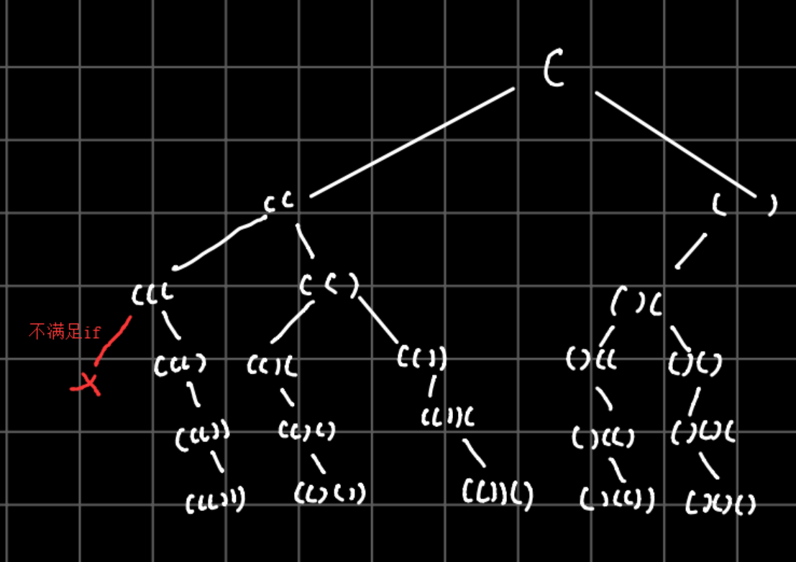

# 22. Generate_Parentheses

[LeetCode 22](https://leetcode.com/problems/generate-parentheses/)


## Methods

### Method 1
1. generate all combinations--using dfs
2. from example, could get a restriction:
    1. every time, `(` appears more or equals to `)`



### Key Points
two variable `left` and `right` to record left bracket and right bracket

### Code
```java
public class Solution {
    /**
     * @param n: n pairs
     * @return: All combinations of well-formed parentheses
     */
    List<String> results = new ArrayList<>(); 
    
    public List<String> generateParenthesis(int n) {
        
        int left = n, right = n; 
        helper(left, right, "");
        
        return results;
    }
    
    public void helper(int left, int right, String path){
        if (left < 0 || right < 0 || left > right) return; // restrictions 
        if (left == 0 && right == 0){
            results.add(path); 
            return; 
        }
        
        //add left (
        helper(left - 1, right, path + "("); 
        //add right )
        helper(left, right - 1, path + ")"); 
    }
    
}

```

## Reference