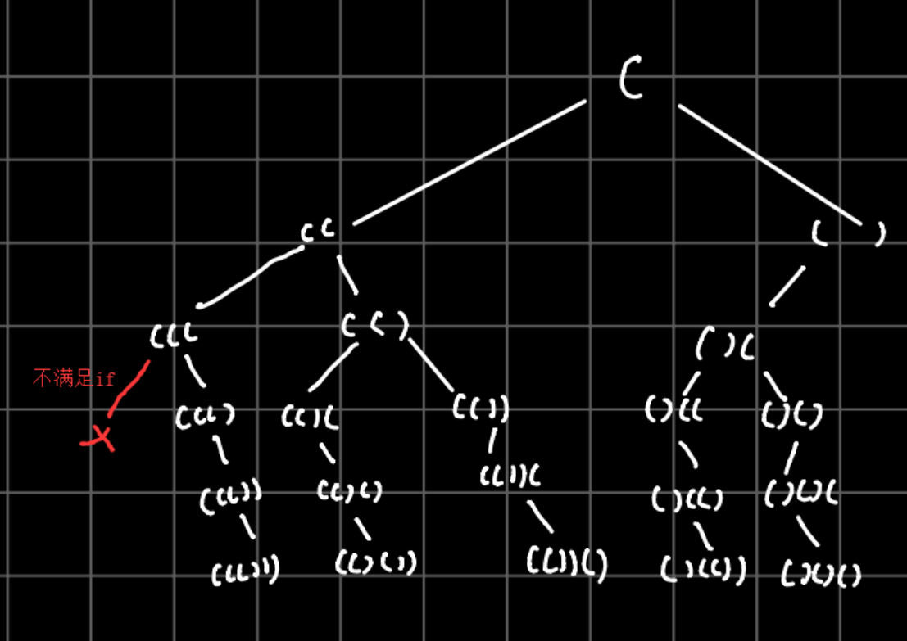

# 22. Generate_Parentheses

[LeetCode 22](https://leetcode.com/problems/generate-parentheses/)

## Methods

### Method 1

1. generate all combinations--using dfs
2. from example, could get a restriction:
    1. every time, `(` appears more or equals to `)`



### Key Points

two variable `left` and `right` to record left bracket and right bracket

### Code

```python
class Solution(object):
    def generateParenthesis(self, n):
        """
        :type n: int
        :rtype: List[str]
        """
        self.ans = []
        self.dfs(n, n, "")
        return self.ans
    def dfs(self, left, right, subString):
        if left < 0:
            return
        if right < 0:
            return
        if left > right:
            return
        if left == 0 and right == 0:
            self.ans.append(subString)
            return

        self.dfs(left - 1, right, subString + "(")
        self.dfs(left, right - 1, subString + ")")
```

## Reference