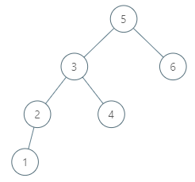

# [LeetCode 285. Inorder Successor in BST](https://leetcode-cn.com/problems/inorder-successor-in-bst/)

Given a binary search tree and a node in it, find the in-order successor of that node in the BST.
The successor of a node p is the node with the smallest key greater than p.val.

Example 1:


```java
Input: root = [2,1,3], p = 1
Output: 2
Explanation: 1's in-order successor node is 2. Note that both p and the return value is of TreeNode type.
```

Example 2:



```java
Input: root = [5,3,6,2,4,null,null,1], p = 6
Output: null
Explanation: There is no in-order successor of the current node, so the answer is null.
```

提示：

* 树中节点的数目在范围 [1, 10＾4] 内。
* -10＾5 <= Node.val <= 10＾5
*树中各节点的值均保证唯一。

## Methods

### Method 1

* `Time Complexity`:
* `Intuition`: BST, root.left < root < root.right; BST的中序遍历, 拿到的是一个递增序列,所以 一个数的in-order processor一定大于等于它
* `Key Points`:
* `Algorithm`:

1. 从根节点开始，每到达一个节点就比较根节点的值和节点p的值
2. 如果当前节点的值小于或等于节点p的值，那么节点p的下一个节点应该在它的右子树
3. 如果当前节点的值大于或等于节点p的值，那么当前节点有可能是p的下一个节点，此时当前节点的值比节点p的值大，但节点p的下一个节点是所有比它大的节点中值最小的一个，因此接下来前往当前节点的左子树，确定是否能找到值更小，但仍然大于节点p的值的节点

### Code

* `Code Design`:

```javascript
/**
 * @param {TreeNode} root
 * @param {TreeNode} p
 * @return {TreeNode}
 */
var inorderSuccessor = function(root, p) {
  let cur = root;
  let result = null;
  while (cur) {
    if (cur.val > p.val) {
      result = cur; // 有可能当前值就是节点
      cur = cur.left;
    } else {
      cur = cur.right;
    }
  }
  return result;
};
```

### Method 2

* `Time Complexity`:
* `Intuition`: BST, root.left < root < root.right; BST的中序遍历, 拿到的是一个递增序列,所以 一个数的in-order processor一定大于等于它
* `Key Points`: dfs递归
* `Algorithm`:

### Code

* `Code Design`:


```Cpp
class Solution {
public:
    TreeNode* inorderSuccessor(TreeNode* root, TreeNode* p) {
        if (!root) return NULL;
        if (root->val <= p->val) {
            return inorderSuccessor(root->right, p);
        } else {
            TreeNode *left = inorderSuccessor(root->left, p);
            return left ? left : root;
        }
    }
};
```

## Reference

[blog](https://www.cnblogs.com/grandyang/p/5306162.html)
[leetcode](https://leetcode-cn.com/problems/P5rCT8/solution/shi-jian-fu-za-du-wei-ceng-gao-de-jie-fa-fheg/)
