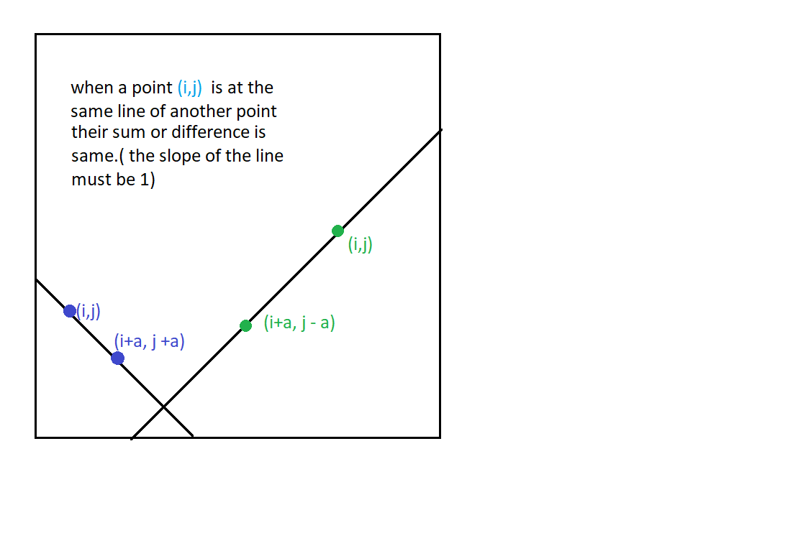

# 51. N-Queens

[LeetCode 51](51. N-Queens)


## Methods

### Method 1
* `Time Complexity`: O(n!)
* `Intuition`:  because every queen occupies in a row, so what we do is just assign a row for every queen
* `Algorithm`: take an example when `n=4` , we put `queen 1` to the first position`(0,0)`. For `queen 2`, after trying `(1,0)``(1,1)`, we put it into `(1,2)`, then after trying, it is valid for `queen 3`. So, using backtraking.


### Key Points
*  assign a row for every queen
* how to examine valid 


### Code
```java
class Solution {
    List<List<String>> results; 
    public List<List<String>> solveNQueens(int n) {
        results = new ArrayList<>(); 
        
        search(n, new ArrayList<>());
        return results; 
    }
    private void search(int n, List<Integer> cols) {
        if (cols.size() == n) {
            results.add(draw(cols)); 
            return;
        }
        for (int colIndex = 0; colIndex < n; colIndex++) {
            if (!valid(cols, colIndex)) continue; // examine if could add a queen in (i, colIndex)
            cols.add(colIndex); 
            search(n, cols);
            cols.remove(cols.size() - 1);
        }
        
    }
    private boolean valid(List<Integer> cols, int curCol) { // test if it is valid when add a queen in (i, colIndex)
        
        int curRow = cols.size();
        
        for (int i = 0; i < cols.size(); i++) {
            // examine every previous queen(i, cols.get(i)) and current queen(curRow, curCol)
            if (cols.get(i) == curCol) return false; 
            //examine 45 
            if (curRow + curCol == i + cols.get(i)) return false; // diagonals /
            if (curRow - curCol == i - cols.get(i)) return false; // diagonals \
        }
        return true; 
    }
    private List<String> draw(List<Integer> cols) {
        List<String> path = new ArrayList<>(); 
        
        for (int row = 0; row < cols.size(); row++) {
            StringBuffer s = new StringBuffer(); 
            for (int j = 0; j < cols.size(); j++) {
                s.append(j == cols.get(row) ? "Q" : ".");
            }
            path.add(s.toString());
        }
        return path;
    }
}

```


## Reference
[LintCode Solution](https://www.jiuzhang.com/solution/n-queens/#tag-highlight-lang-java)