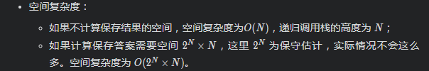
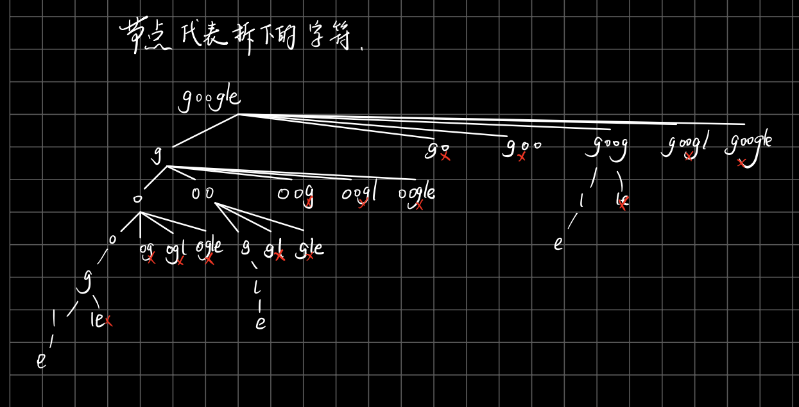

# [LeetCode 131. Palindrome Partitioning](https://leetcode-cn.com/problems/palindrome-partitioning/)

## Methods

### Method 1

* `Time Complexity`: O(N *  2^N); 这里 NN 为输入字符串的长度，每一个位置可拆分，也可不拆分，尝试是否可以拆分的时间复杂度为 O(2^N)，判断每一个子串是否是回文子串，时间复杂度为 O(N)
* `Space Complexity`: 
* `Intuition`: DFS
* `Key Points`: 每个节点表示拆下来的字符串
* `Algorithm`:

我们考虑, 对于一个string: `google`:

1. 第一层, 考虑为先拆一个字符`g`, 剩下`oogle`
2. 第二层, 考虑拆一个字符`o`, 剩下`ogle`
3. 第三层, 考虑拆一个字符`o`, 剩下`gle`
4. 第四层, 考虑拆一个字符`g`, 剩下`le`
5. 第五层, 考虑拆一个字符`l`, 剩下`e`
6. 第六层, 考虑拆`e`, 剩下空, 因为这一路径所有都是回文, 所以答案[g, o, o, g, l, e]
7. 回到第五层, 考虑拆两个字符`le`, 因为不是回文, 没必要再往下
8. 回到第四层, 考虑拆两个字符`gl`, 不是回文; 考虑拆三个字符`gle`不是回文
...

图如下:



### Code1

* `Code Design`:

```python
class Solution:
    def partition(self, s):
        self.results = []
        self.dfs(s, [], 0)
        return self.results

    def dfs(self, s, path, startIndex):
        if startIndex == len(s):
            self.results.append(copy.deepcopy(path))
            return

        for endIndex in range(startIndex, len(s) + 1): # 这里是len(s) +１
            subString = s[startIndex : endIndex]
            if not subString:
                continue
            if not self.isPalin(subString):
                continue
            path.append(subString)
            self.dfs(s, path, endIndex)
            path.pop()

    def isPalin(self, s):
        left = 0
        right = len(s) - 1
        while (left < right):
            if (s[left] != s[right]):
                return False

            left += 1
            right -= 1

        return True
```

## Reference1

[video](https://www.youtube.com/watch?v=3jvWodd7ht0)

作者：liweiwei1419
链接：https://leetcode-cn.com/problems/palindrome-partitioning/solution/hui-su-you-hua-jia-liao-dong-tai-gui-hua-by-liweiw/

----------------------

### Method 2

* `Time Complexity`: O(2^N)
* `Space Complexity`:
* `Intuition`:
* `Key Points`:
* `Algorithm`:

对判断是否为回文串方法进行优化, 利用动态规划

### Code2

* `Code Design`:

```java

import java.util.ArrayDeque;
import java.util.ArrayList;
import java.util.Deque;
import java.util.List;

public class Solution {

    public List<List<String>> partition(String s) {
        int len = s.length();
        List<List<String>> res = new ArrayList<>();
        if (len == 0) {
            return res;
        }

        char[] charArray = s.toCharArray();
        // 预处理
        // 状态：dp[i][j] 表示 s[i][j] 是否是回文
        boolean[][] dp = new boolean[len][len];
        // 状态转移方程：在 s[i] == s[j] 的时候，dp[i][j] 参考 dp[i + 1][j - 1]
        for (int right = 0; right < len; right++) {
            // 注意：left <= right 取等号表示 1 个字符的时候也需要判断
            for (int left = 0; left <= right; left++) {
                if (charArray[left] == charArray[right] && (right - left <= 2 || dp[left + 1][right - 1])) {
                    dp[left][right] = true;
                }
            }
        }

        Deque<String> stack = new ArrayDeque<>();
        dfs(s, 0, len, dp, stack, res);
        return res;
    }

    private void dfs(String s, int index, int len, boolean[][] dp, Deque<String> path, List<List<String>> res) {
        if (index == len) {
            res.add(new ArrayList<>(path));
            return;
        }

        for (int i = index; i < len; i++) {
            if (dp[index][i]) {
                path.addLast(s.substring(index, i + 1));
                dfs(s, i + 1, len, dp, path, res);
                path.removeLast();
            }
        }
    }
}
```

## Reference2

作者：liweiwei1419
链接：https://leetcode-cn.com/problems/palindrome-partitioning/solution/hui-su-you-hua-jia-liao-dong-tai-gui-hua-by-liweiw/
