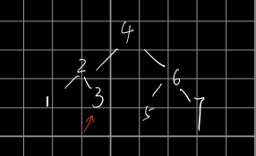

# [LeetCode 98. Validate Binary Search Tree](https://leetcode-cn.com/problems/validate-binary-search-tree/)

## Methods

### Method 1

* `Time Complexity`:
* `Space Complexity`:
* `Intuition`:
* `Key Points`:
* `Algorithm`:

中序遍历, 遍历节点递增才能说明是个BST.
但是要考虑, 下图:



遍历到位置3时候, 我们要判断它是否比位置2处的数大, 这时候只能用一个变量记住该位置.
遍历到4位置时候同理, 要有变量记住位置3

### Code1

* `Code Design`:

```python
class Solution:
    def isValidBST(self, root: TreeNode) -> bool:
        self.pre = float('-inf')
        self.ans = True
        self.dfs(root)
        return self.ans

    def dfs(self, node):
        if self.ans is False:
            return
        if node is None:
            return
        self.dfs(node.left)

        if self.lastNodeVal >= node.val:
            self.ans = False
        self.lastNodeVal = node.val

        self.dfs(node.right)
```

## Reference1

----------------------

### Method 2

* `Time Complexity`:
* `Space Complexity`:
* `Intuition`:
* `Key Points`:
* `Algorithm`:

use stack to iterate, and also needs to use `pre`

### Code2

* `Code Design`:

```python
class Solution:
    def isValidBST(self, root: TreeNode) -> bool:
        stack = []
        node = root

        while node:
            stack.append(node)
            node = node.left
            prev = float('-inf')

        while stack:
            node = stack.pop()
            if node.val <= prev:
                return False
            prev = node.val
            if node.right:
                node1 = node.right
                while node1:
                    stack.append(node1)
                    node1 = node1.left
        return True
```

after optimized

```python
class Solution(object):
    def isValidBST(self, root):
        """
        :type root: TreeNode
        :rtype: bool
        """
        stack = []
        cur = root
        lastNodeVal = float('-inf')
        while stack or cur:
            while cur:
                stack.append(cur)
                cur = cur.left
            cur = stack.pop()
            if cur.val <= lastNodeVal:
                return False
            lastNodeVal = cur.val
            cur = cur.right
        return True
```

## Reference2
