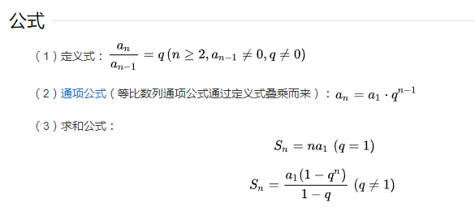

# 知识点

## 二叉树叶子节点数量 > 所有非叶子节点数量和 + 1

二叉树叶子节点数量大于所以非叶子节点的数量和

想象一个数, 第一层节点数1, 第二层节点数2, 第三层节点数4...

1 + 2 + 4 + 8 + 16 + ... + 2^(n-1) + 2^n

根据等比数列求和公式

非叶子节点数量 = 1 + 2 + 4 + ... + 2^(n-1) = 2^n - 1
叶子节点的数量 = 2^n
