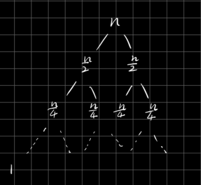

# 知识点

## 1. 等比数列公式

## 2. 二叉树叶子节点数量 > 所有非叶子节点数量

结论:

1. 二叉树叶子节点数量大于所以非叶子节点的数量和
2. 非叶子节点数量和 = 叶子节点数量和 / 2 - 1

想象一个数, 第一层节点数1, 第二层节点数2, 第三层节点数4...

1 + 2 + 4 + 8 + 16 + ... + 2^(n-1) + 2^n

根据等比数列求和公式

非叶子节点数量 = 1 + 2 + 4 + ... + 2^(n-1) = 2^(n-1) - 1
叶子节点的数量 = 2^n

其实有个更简单的办法记住, 第一层1个节点 小于第二层2个节点; 第1和2层3个节点, 小于第三层4个节点, 第1,2,3层7个节点, 小于第四层8个节点....所有非叶子节点数量和小于叶子节点数量和

## 3. 求树的时间复杂度

求树的时间复杂度,就是求树共多少个节点

### 3.1 如果一个二叉树有 n 层

那么这是个等比数列求和问题.

总节点数 = 第一层节点数 + 第二层节点数 + ... + 最后一层节点数 = 1 + 2 + 4 + ...+ 2^n = 2^n - 1

所以一个深n层的树, 时间复杂度为O(2^n)

-----

### 3.2 如果一个二叉树的root为 n, 每层递减 1/2倍

要想知道他有多少层, 应该根据等比数列通项公式来求, 设`n, n/2, n/4, ..., 1` 总共有x个, 根据通项公式 推导如下:

所以最后 `x = log2(N) + 1｀, 总共有log2(N)层, 所以
总节点数= 2n - 1 约等于 n

所以merge sort需要O(NlogN)是因为总共n个节点, 每个节点还要进行logN比较, 相乘就是NlogN