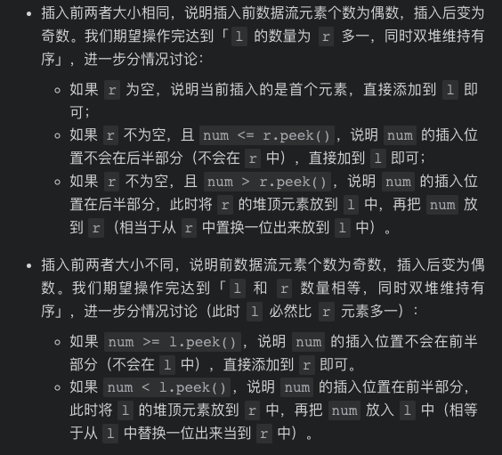

# [LeetCode 295. Find Median from Data Stream](https://leetcode-cn.com/problems/find-median-from-data-stream/)

## Methods

### Method 1

* `Time Complexity`: addNum为O(logN), findMedian为O(1)
* `Space Complexity`: O(n)
* `Intuition`:
* `Key Points`:
* `Algorithm`:

这道题的题目解释：

每输入进一个数，就对数组进行排序，取中位数。中位数的定义就是, 在一堆数里面, 中位数左边的数都比他小, 右边的数都比他大, 且中位数左右两边的数的数量相同. 基于上述, 可以考虑用两个heap来实现. 左边的heap为max heap, 右边的heap为min heap. 只要保持左右heap内的数字数量保持一致(偶数个数), 或左边heap比右边多一(奇数个数)时候, 堆顶元素就是栈顶元素




### Code1

* `Code Design`:

```python
class MedianFinder:

    def __init__(self):
        self.minHeap, self.maxHeap = [], []

    def addNum(self, num: int) -> None:
        if len(self.maxHeap) == 0 or num <= -self.maxHeap[0]:
            heapq.heappush(self.maxHeap, -num)
        else:
            heapq.heappush(self.minHeap, num)
        # 此时要么左边比右边多1个, 要么相等, 要么右边比左边多1个
        if len(self.maxHeap) - len(self.minHeap) > 1:
            heapq.heappush(self.minHeap, -heapq.heappop(self.maxHeap))
        elif len(self.maxHeap) < len(self.minHeap):
            heapq.heappush(self.maxHeap, -heapq.heappop(self.minHeap))
    def findMedian(self) -> float:
        if len(self.maxHeap) != len(self.minHeap):
            return -self.maxHeap[0]
        else:
            return (self.minHeap[0] - self.maxHeap[0]) * 0.5

```

```python
class MedianFinder:

    def __init__(self):
        self.minHeap = []
        self.maxHeap = []

    def addNum(self, num: int) -> None:
      if len(self.maxHeap) > len(self.minHeap):
         heapq.heappush(self.minHeap, num)
      else:
         heapq.heappush(self.maxHeap, -num)

      if len(self.maxHeap) != 0 and len(self.minHeap) !=0 and -self.maxHeap[0] > self.minHeap[0]:
         heapq.heappush(self.minHeap, -heapq.heappop(self.maxHeap))
         heapq.heappush(self.maxHeap, -heapq.heappop(self.minHeap))


    def findMedian(self) -> float:
        totalLen = len(self.minHeap) + len(self.maxHeap)
        # 奇
        if (totalLen % 2 == 1): return -self.maxHeap[0]
        # 偶
        return (self.minHeap[0] - self.maxHeap[0]) / 2

```

### Follow Up

Q:如果数据流中所有整数都在 0 到 100 范围内，你将如何优化你的算法？

A:存储一个100范围的arr数组，记录0-100数据出现的个数，以及总的数据的个数，遍历arr数组，可以计算出中位数

Q:如果数据流中 99% 的整数都在 0 到 100 范围内，你将如何优化你的算法？

A:如上还是维持以上的一个arr数组，对于<0和>100的数据，统计个数，这部分数据对结果不会产生影响，因为中位数出现在99%的数据里面，即0-100这个范围内

## Reference1

[leetcode ans](https://leetcode-cn.com/problems/find-median-from-data-stream/solution/feng-xian-dui-chong-dui-ding-dui-qiu-zho-a36j/)
[follow up ans](https://leetcode-cn.com/problems/find-median-from-data-stream/solution/gong-shui-san-xie-jing-dian-shu-ju-jie-g-pqy8/)