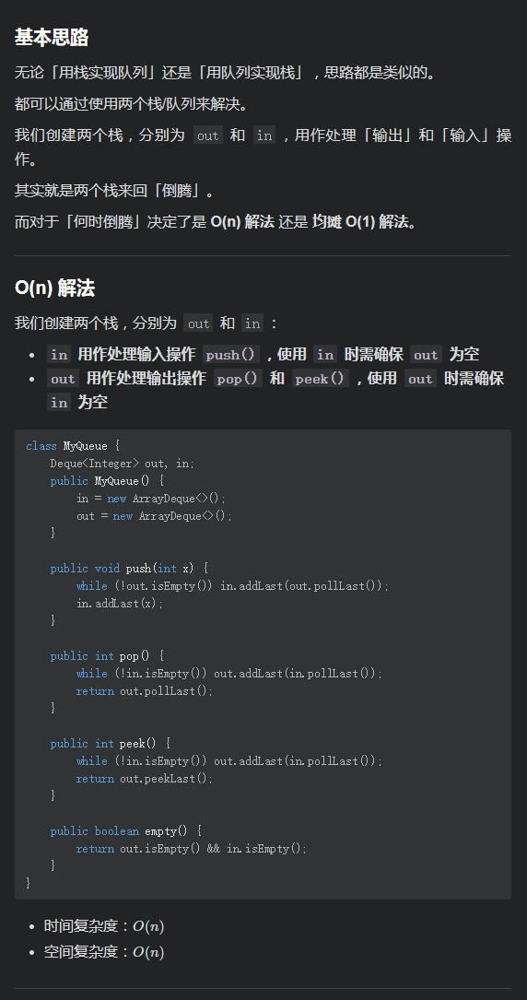
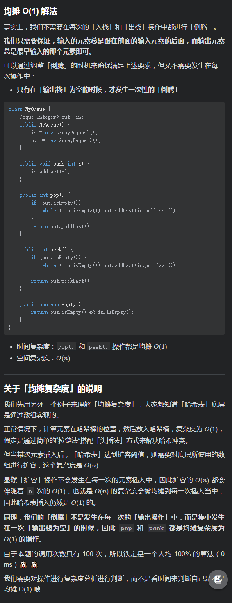

# [LeetCode 232. Implement Queue using Stacks](https://leetcode-cn.com/problems/implement-queue-using-stacks/)

## Methods

### Method 1

* `Time Complexity`: O(1), `pop()` 和 `peek()` 操作都是均摊`O(1)`
* `Space Complexity`: O(n)
* `Intuition`:
* `Key Points`:
* `Algorithm`:

## Reference1

[leetcode](https://leetcode-cn.com/problems/implement-queue-using-stacks/solution/sha-shi-jun-tan-fu-za-du-ya-wo-de-suan-f-gb6d/)