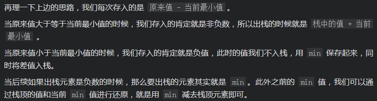

# [LeetCode 155. Min Stack](https://leetcode-cn.com/problems/min-stack/)

## Methods

### Method 1

* `Time Complexity`: 所有操作都是O(1)
* `Space Complexity`: O(n)
* `Intuition`:
* `Key Points`:
* `Algorithm`:


维护两个栈, 另一个栈维护当前的最小值

### Code1

* `Code Design`:

```python
class MinStack:
    def __init__(self):
        self.stack = []
        self.min_stack = [math.inf]

    def push(self, x: int) -> None:
        self.stack.append(x)
        self.min_stack.append(min(x, self.min_stack[-1]))

    def pop(self) -> None:
        self.stack.pop()
        self.min_stack.pop()

    def top(self) -> int:
        return self.stack[-1]

    def getMin(self) -> int:
        return self.min_stack[-1]

```

## Reference1

[leetcode solution](https://leetcode-cn.com/problems/min-stack/solution/zui-xiao-zhan-by-leetcode-solution/)

----------------------

### Method 2

* `Time Complexity`:
* `Space Complexity`:
* `Intuition`:
* `Key Points`:
* `Algorithm`:

是否可以考虑优化第二个栈?


----------------------

### Method 3/4


```
入栈 3，存入 3 - 3 = 0
|   |   min = 3
|   |     
|_0_|    
stack   

入栈 5，存入 5 - 3 = 2
|   |   min = 3
| 2 |     
|_0_|    
stack  

入栈 2，因为出现了更小的数，所以我们会存入一个负数，这里很关键
也就是存入  2 - 3 = -1, 并且更新 min = 2 
对于之前的 min 值 3, 我们只需要用更新后的 min - 栈顶元素 -1 就可以得到    
| -1|   min = 2
| 5 |     
|_3_|    
stack  

入栈 6，存入  6 - 2 = 4
| 4 |   min = 2
| -1| 
| 5 |     
|_3_|    
stack  

出栈，返回的值就是栈顶元素 4 加上 min，就是 6
|   |   min = 2
| -1| 
| 5 |     
|_3_|    
stack  

出栈，此时栈顶元素是负数，说明之前对 min 值进行了更新。
入栈元素 - min = 栈顶元素，入栈元素其实就是当前的 min 值 2
所以更新前的 min 就等于入栈元素 2 - 栈顶元素(-1) = 3
|   | min = 3
| 5 |     
|_3_|    
stack     
```


```java
public class MinStack {
long min;
Stack<Long> stack;

public MinStack(){
    stack=new Stack<>();
}

public void push(int x) {
    if (stack.isEmpty()) {
        min = x;
        stack.push(x - min);
    } else {
        stack.push(x - min);
        if (x < min){
            min = x; // 更新最小值
        }

    }
}

public void pop() {
    if (stack.isEmpty())
        return;

    long pop = stack.pop();

    //弹出的是负值，要更新 min
    if (pop < 0) {
        min = min - pop;
    }

}

public int top() {
    long top = stack.peek();
    //负数的话，出栈的值保存在 min 中
    if (top < 0) {
        return (int) (min);
    //出栈元素加上最小值即可
    } else {
        return (int) (top + min);
    }
}

public int getMin() {
    return (int) min;
}
}

```

