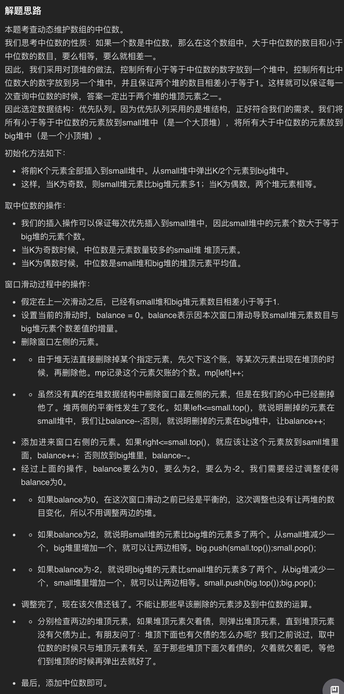
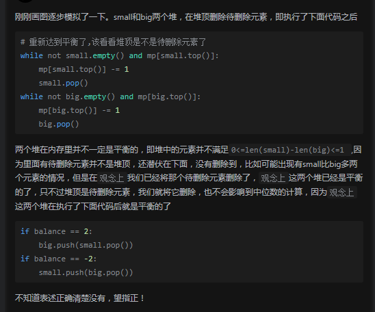

# [LeetCode 480. Sliding Window Median](https://leetcode-cn.com/problems/sliding-window-median/)

## Methods

### Method 1

* `Time Complexity`:
* `Space Complexity`:
* `Intuition`:
* `Key Points`:
* `Algorithm`:



其中:
`small`表示左边的max heap, `big`表示右边的min heap
`balance`表示`small`比`big`多了多少个数字, 要除去`延迟删除`的数字
`mp`的key表示要被延迟删除的数, value表示延迟删除的数的个数

### Code1

* `Code Design`:

```cpp
class Solution {
public:
    priority_queue<int> small;
    priority_queue<int, vector<int>, greater<int> > big;
    unordered_map<int, int> mp;
    // 建立window
    double get(int& k){
        if(k%2) return small.top();
        else return ((long long)small.top()+big.top())*0.5;
    }
    vector<double> medianSlidingWindow(vector<int>& nums, int k) {
        for(int i = 0; i < k; i++){small.push(nums[i]);};
        for(int i = 0; i < k / 2; i++){big.push(small.top()); small.pop();}
        vector<double> ans{get(k)};
        for(int i = k; i < nums.size(); i++){
            int balance = 0;
            int l = nums[i-k];
            mp[l]++;
            if(!small.empty() && l<=small.top()){balance--;}
            else {balance++;}
            if(!small.empty() && nums[i] <= small.top()){
                small.push(nums[i]);
                balance++;
            }
            else{
                big.push(nums[i]);
                balance--;
            }
            if(balance>0){
                big.push(small.top());
                small.pop();
            }
            if(balance<0){
                small.push(big.top());
                big.pop();
            }
            while(!small.empty() && mp[small.top()]>0){
                mp[small.top()]--;
                small.pop();
            }
            while(!big.empty() && mp[big.top()]>0){
                mp[big.top()]--;
                big.pop();
            }
            ans.push_back(get(k));
        }
        return ans;
    }
};

```

## Reference1

[leetcode ans](https://leetcode-cn.com/problems/sliding-window-median/solution/feng-xian-dui-chong-shuang-dui-dui-ding-hq1dt/)

----------------------

### Method 2

* `Time Complexity`:
* `Space Complexity`:
* `Intuition`:
* `Key Points`:
* `Algorithm`:

因为python没有大根堆，所以额外定义了一个类，通过传参来创建大根堆或者小根堆。



### Code2

* `Code Design`:

```python
class Heap:
    def __init__(self, name="min"):
        self.arr = []
        self.f = lambda x: x if name=="min" else -x
    def push(self, num):
        heapq.heappush(self.arr, self.f(num))                   # 推入一个
    def pop(self):
        return self.f(heapq.heappop(self.arr))                  # 弹出堆顶
    def top(self):
        return self.f(self.arr[0])
    def empty(self):
        return len(self.arr) == 0

class Solution:
    def medianSlidingWindow(self, nums: List[int], k: int) -> List[float]:
        small = Heap(name="max") # 较小数字部分使用大根堆
        big = Heap(name="min")   # 较大数字部分使用小根堆
        get_mid = lambda x, y: x.top() if k % 2 else (x.top() + y.top()) / 2
        mp = collections.defaultdict(int)
        for i in range(k):
            small.push(nums[i])
        for i in range(k//2):
            big.push(small.pop())
        ans = [get_mid(small, big)]
        for i in range(k, len(nums)):
            balance = 0
            l, r = nums[i-k], nums[i]  # 将被删除的窗口最左元素和将被添加到窗口最右的元素
            mp[l] += 1                 # 左窗口元素记账
            if l <= small.top():
                balance -= 1           # 较小数字堆需删除一个元素
            else:
                balance += 1           # 较大数字堆需删除一个元素
            if r <= small.top():
                balance += 1           # 较小数字堆添加一个元素
                small.push(r)
            else:
                balance -= 1           # 较大数字堆添加一个元素
                big.push(r)
            """
            此时balance取值可能是:
            balance | small | big  | 解释
              0     | -1+1  |      | 较小数字堆删除一个元素添加一个元素，两边还是平衡的
              0     |       | +1-1 | 较大数字堆删除一个元素添加一个元素，两边还是平衡的
             -2     | -1    | -1   | 较小数字堆删除一个元素，较大数字堆添加一个元素，失衡
              2     | +1    | +1   | 较大数字堆删除一个元素，较小数字堆添加一个元素，失衡
            """
            # 较小数字堆挪一个给较大数字堆(3,3)->(4,2)->(3,3)或者(4,3)->(5,2)->(4,3)
            if balance == 2:
                big.push(small.pop())
            # 较大数字堆挪一个给较小数字堆(3,3)->(2,4)->(3,3)或者(4,3)->(3,4)->(4,3)
            if balance == -2:
                small.push(big.pop())
            # 重新达到平衡了,该看看堆顶是不是待删除元素了
            # 这里先删除small 再删除 big, 因为默认的如果等于堆顶元素, 就会放入small中, 所以
            # 奇数个时候, small可能比big多一个数; 删除时候, 如果遇到big和small的堆顶元素相同 但是只需要删除一个的时候,
            # 就要先删除small的
            while not small.empty() and mp[small.top()]:
                mp[small.top()] -= 1
                small.pop()
            while not big.empty() and mp[big.top()]:
                mp[big.top()] -= 1
                big.pop()
            # 为什么删除堆顶元素后不用重新平衡两边堆了呢？
            ans.append(get_mid(small, big))
        return ans
```

## Reference2

[leetcode评论](https://leetcode-cn.com/problems/sliding-window-median/solution/feng-xian-dui-chong-shuang-dui-dui-ding-hq1dt/)