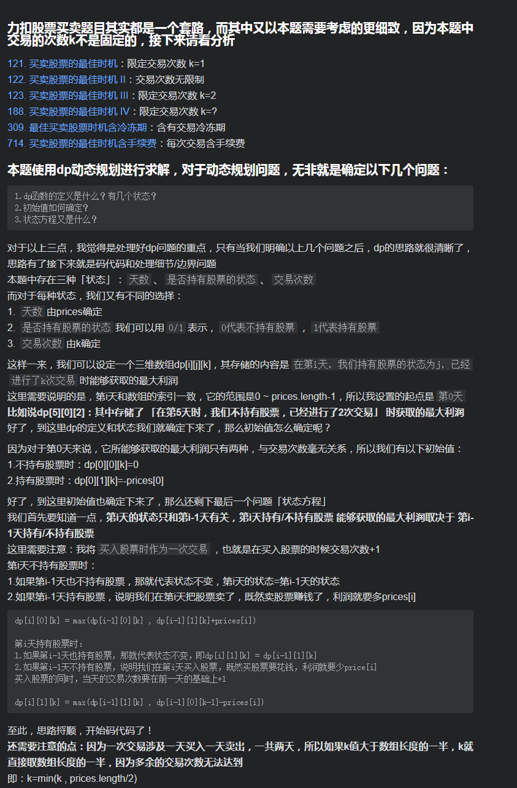
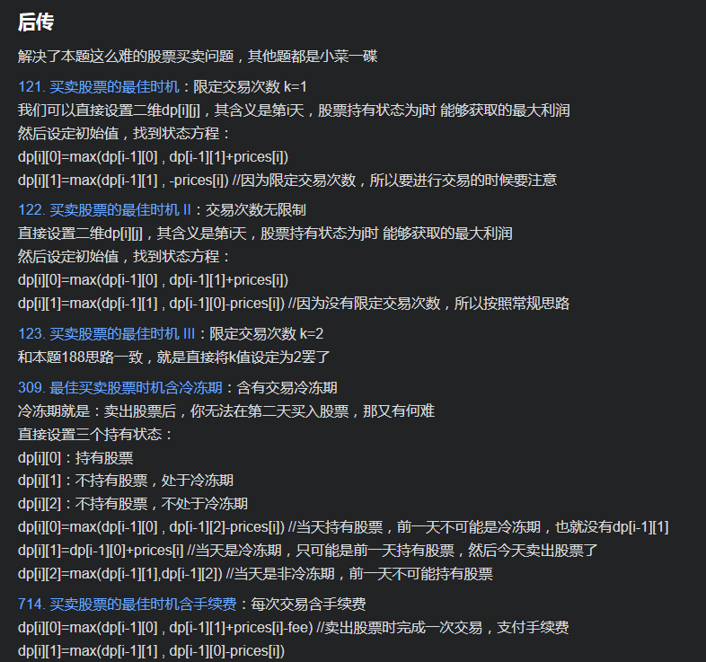

# [LeetCode 188. Best Time to Buy and Sell Stock IV](https://leetcode-cn.com/problems/best-time-to-buy-and-sell-stock-iv/)

## Methods

### Method 1

* `Time Complexity`:
* `Space Complexity`:
* `Intuition`:
* `Key Points`:
* `Algorithm`:




### Code1

* `Code Design`:

```java
class Solution {
    public int maxProfit(int K, int[] prices) {//这里悄咪咪把小k换成了大K，便于后续索引赋值
        int n=prices.length;
        if(n<=1)    return 0;
        //因为一次交易至少涉及两天，所以如果k大于总天数的一半，就直接取天数一半即可，多余的交易次数是无意义的
        K=Math.min(K,n/2);

        /*dp定义：dp[i][j][k]代表 第i天交易了k次时的最大利润，其中j代表当天是否持有股票，0不持有，1持有*/
        int[][][] dp=new int[n][2][K+1]; // 因为可交易的次数是0-k，共有 k+1个数
        // 第 0 天, 不持有股票, 不管交易次数, 都是 0
        // 第 0 天, 持有股票, 不管交易次数, 都是 -prices[0]
        for(int k = 0;k <= K; k++){
            dp[0][0][k]=0;
            dp[0][1][k]=-prices[0];
        }

        /*状态方程：
        dp[i][0][k]，当天不持有股票时，看前一天的股票持有情况
        dp[i][1][k]，当天持有股票时，看前一天的股票持有情况*/
        for(int i=1;i<n;i++){
            for(int k=1;k<=K;k++){
                dp[i][0][k]=Math.max(dp[i-1][0][k],dp[i-1][1][k]+prices[i]);
                dp[i][1][k]=Math.max(dp[i-1][1][k],dp[i-1][0][k-1]-prices[i]);
            }
        }
        return dp[n-1][0][K];
    }
}
```

## Reference1

作者：Destinytomycode
链接：https://leetcode-cn.com/problems/best-time-to-buy-and-sell-stock-iv/solution/javayi-ge-si-lu-da-bao-suo-you-gu-piao-t-pd1p/