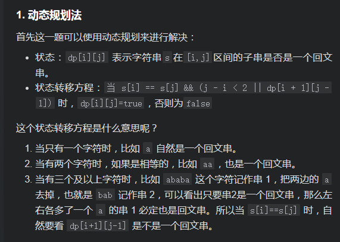
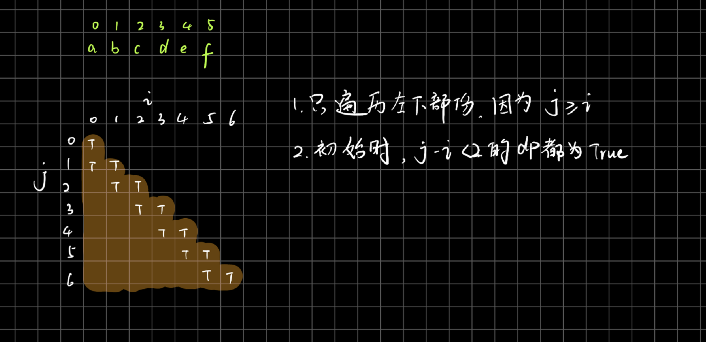

# [LeetCode 647. Palindromic Substrings](https://leetcode-cn.com/problems/palindromic-substrings/)

## Methods

### Method 1

* `Time Complexity`: O(n^2)
* `Space Complexity`:
* `Intuition`: dp
* `Key Points`:
* `Algorithm`:




### Code

* `Code Design`:

```java

class Solution {
    public int countSubstrings(String s) {
        // 动态规划法
        boolean[][] dp = new boolean[s.length()][s.length()];
        int ans = 0;

        for (int j = 0; j < s.length(); j++) {
            for (int i = 0; i <= j; i++) {
                if (s.charAt(i) == s.charAt(j) && (j - i < 2 || dp[i + 1][j - 1])) {
                    dp[i][j] = true;
                    ans++;
                }
            }
        }

        return ans;
    }
}
```

----------------------

### Method 2

* `Time Complexity`:
* `Space Complexity`:
* `Intuition`:
* `Key Points`:
* `Algorithm`:

### Code

* `Code Design`:

```java


```

## Reference
