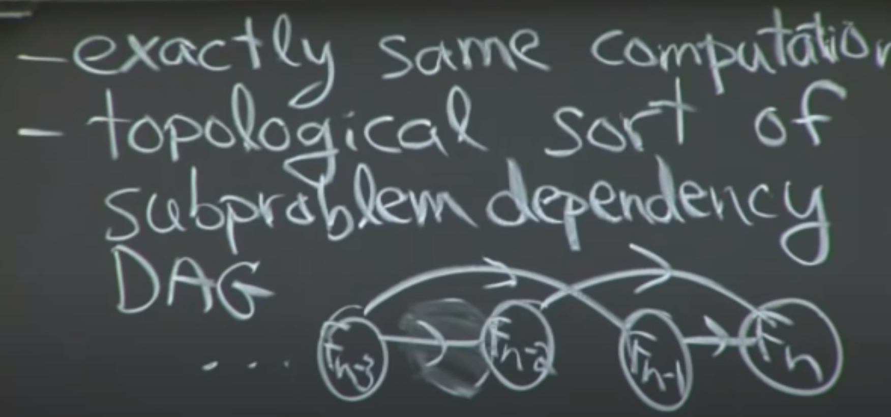

# dynamic programming

## concept

dynamic programming is only know polynomial time algorithm. It is a careful brute force method.

dp = sub-problems + reuse

## Fibonacci

use recursion:

```python
fib(n):
    memo = {}
    if n in memo: return memo
    if n < 2: return f1
    else: f = fib(n-1) + fib(n-2)
    memo[n] = f
    return f
```

use dp:

```python
fib(n):
    for k in range(n):
        if k < 2: f = 1
        else: f = fib(k-1) + fib(k-2)
        fib(k) = f
    return fib(n)
```

they are almost the same, just recursion is from top to down(imaging a tree, root is f(n), and leaf node is f(1)) and dp is from bottom to top

## dp is

