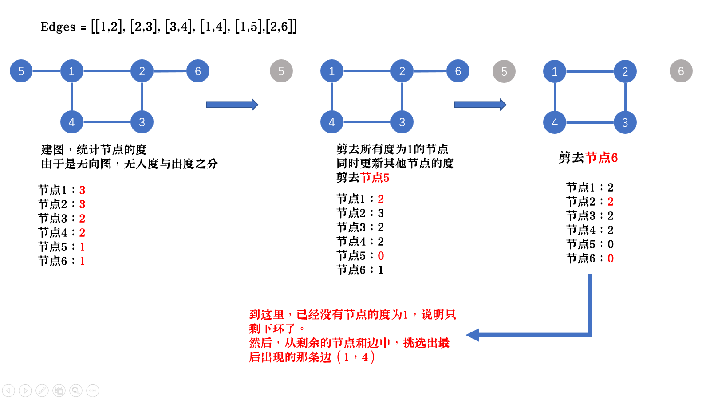

# [LeetCode 684. Redundant Connection](https://leetcode-cn.com/problems/redundant-connection/)

## Methods

### Method 1

* `Time Complexity`:
* `Space Complexity`:
* `Intuition`: 先看[Union Find](../Union_Find/readme.md)
* `Key Points`: input is array, need use Union Find Algorithm to transfer it to a graph
* `Algorithm`:

初始化, 因为节点的值是从`1`开始的, 所以建立一个union find类, 该类的数组`parent`长度为节点数量的数组
每次拿到的一对edge, 代表一对连接关系. 此时我们连接他们, 建立union find图. 当然连接前, 判断是否该edge的两个节点已经在一个`连通分量`内, 如果
在, 说明再连接他们一定形成环, 直接返回答案

### Code1

* `Code Design`:

```python
class Solution:
    def findRedundantConnection(self, edges: List[List[int]]) -> List[int]:
        unionFind = UnionFind(len(edges) + 1)

        for i in range(len(edges)):
            p, q = edges[i][0], edges[i][1]
            rootP = unionFind.find(p)
            rootQ = unionFind.find(q)
            if rootP == rootQ:
                return [p, q]
            else:
                unionFind.parent[rootP] = q


class UnionFind:
    def __init__(self, count):
        self.parent = [i for i in range(count)]

    def union(self, p, q):
        parentP = self.find(p)
        parentQ = self.find(q)
        if parentP == parentQ:
            return False
        self.parent[parentP] = q
        return True

    def find(self, node):
        while self.parent[node] != node:
            node = self.parent[node]
        return node
```

## Reference1

[Union Find](../Union_Find/readme.md)
[只用看并查集](https://leetcode-cn.com/problems/redundant-connection/solution/bing-cha-ji-sou-suo-shen-du-yan-du-tuo-b-ev30/)

----------------------

### Method 2

* `Time Complexity`:
* `Space Complexity`:
* `Intuition`: 拓扑排序
* `Key Points`:
* `Algorithm`:

拓扑排序主要是通过计算节点的度来进行剪枝。
对于无向图来说，度的节点为1，说明该节点只与一条边相连，不可能形成环。

所以拓扑分两步：

剪枝所有度为1的节点
更新与第1步中相连节点的度
重复前两步，直到不存在度为1的节点
说明此时只剩下环了，然后返回环中最后出现的那条边。



### Code2

* `Code Design`:

```java
    public int[] findRedundantConnection(int[][] edges) {
        //拓扑实现
        //构建邻接表和入度表

        if(edges == null || edges.length == 0 || edges[0].length == 0){
            return new int[0];
        }
        int len = edges.length;
        // 构建入度和邻接表
        int[] inDegree = new int[len + 1];
        Set<Integer>[] map = new HashSet[len + 1];
        for(int[] edge: edges){

            inDegree[edge[0]]++;
            inDegree[edge[1]]++;

            if(map[edge[0]] == null){
                map[edge[0]] = new HashSet<>();
            }
            map[edge[0]].add(edge[1]);

            if(map[edge[1]] == null){
                map[edge[1]] = new HashSet<>();
            }
            map[edge[1]].add(edge[0]);
        }

        //如果一个无向图的入度为1，可作为遍历起点，建立队列入队
        Queue<Integer> queue = new LinkedList<>();
        for(int i = 1; i < len + 1; i++){
            if(inDegree[i] == 1){
                queue.add(i);
            }
        }

        //将队列中的入度为1 的点出队，将与其相邻的点入度减一，如果剩余1，可以作为新的遍历起点
        while(!queue.isEmpty()){
            int num = queue.poll();
            for(int j: map[num]){
                if(--inDegree[j] == 1){
                    queue.add(j);
                }
            }
        }

        for(int i = len; i > 0; i--){
            if(inDegree[edges[i - 1][0]] > 1 && inDegree[edges[i - 1][1]] > 1){
                return edges[i - 1];
            }
        }
        return new int[0];
    }

```

## Reference2

[代码](https://leetcode-cn.com/problems/redundant-connection/solution/java-dfstuo-bu-pai-xu-bing-cha-ji-shi-xian-by-xgpx/)
[思路](https://leetcode-cn.com/problems/redundant-connection/solution/liang-chong-jie-fa-bing-cha-ji-topopai-x-7haq/)