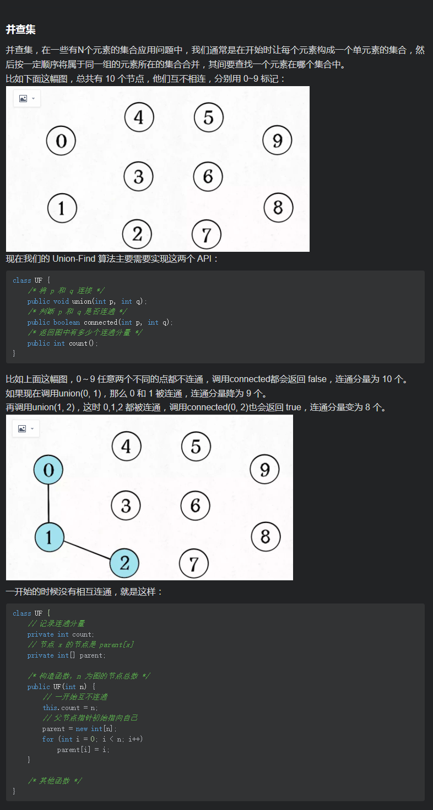
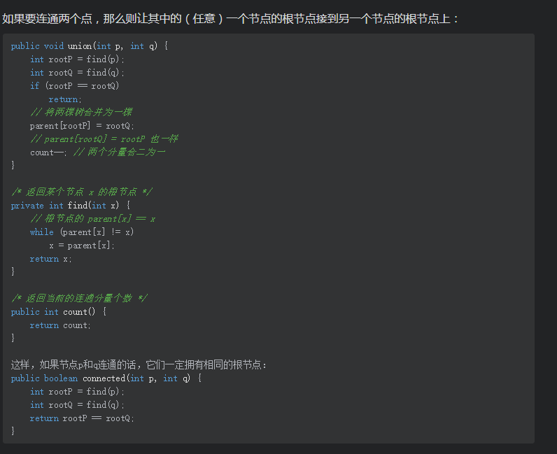

# Union Find




```java
package UnionFind;

/**
 * @Author chuancey
 * @Date 2021/3/18
 * @Description
 */
public class UnionFind {
     private int count; //记录连通分量
     private int[]parent; //节点x的根节点是parent[x]
     public UnionFind(int n){
         //一开始互不相通
         this.count=n;
         //一开始，每个节点是自己的父节点
         parent=new int[n];
         for (int i = 0; i <n ; i++) {
             parent[i]=i;
         }
     }
      /*
      将p和q连接, 如果两个节点被连通，那么则让其中的一个根节点连接到另一个节点的根节点上
      */
     public void union(int p,int q){
         int rootP=find(p);
         int rootQ=find(q);
         if(rootP==rootQ){
             return;
         }
         //将两颗树合并为一颗
         parent[rootP]=rootQ; //parent[rootQ]=rootP 效果是一样的
         count--; //两个分量合二为一
     }
     //返回某个节点x的根节点
     private int find(int x){
          //根节点的parent[x]==x
          while (parent[x]!=x){
              x=parent[x];
          }
          return x;
     }
     /*
      判断p和q是否连通:如果两个节点是连通的，那么他们一定拥有相同的根节点
      */
     public boolean connected(int p,int q){
         int rootP=find(p);
         int rootQ=find(q);
         return rootP==rootQ;
     }
     /*
     返回具体有多少个连通分量
      */
      public int count(){
         return count;
      }
}
```

## reference

链接：https://leetcode-cn.com/problems/redundant-connection/solution/zui-rong-yi-li-jie-de-bing-cha-ji-xiang-abg0f/
作者：Chuancey