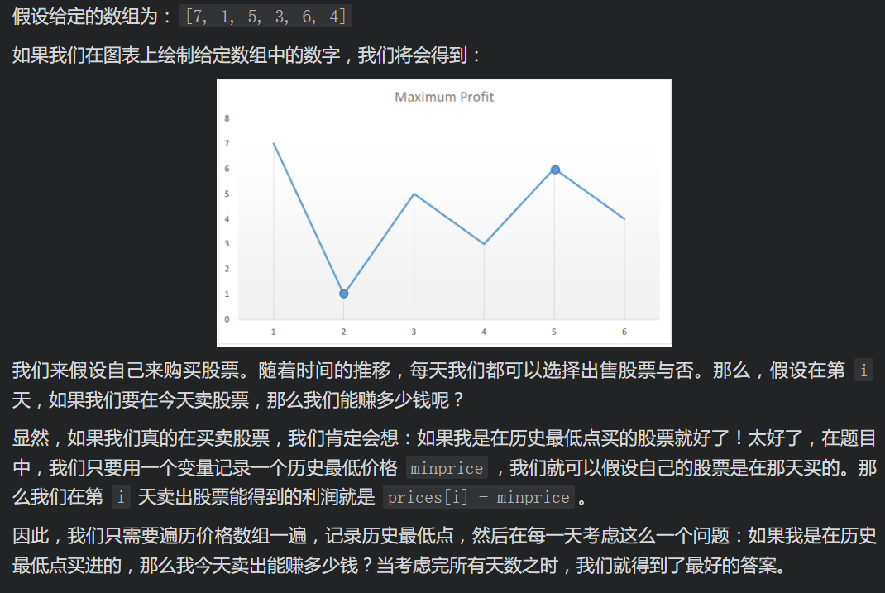

# [LeetCode 121. Best Time to Buy and Sell Stock](https://leetcode-cn.com/problems/best-time-to-buy-and-sell-stock/)

## Methods

### Method 1

* `Time Complexity`: O(n)
* `Space Complexity`: O(1)
* `Intuition`:
* `Key Points`:
* `Algorithm`:



### Code1

* `Code Design`:

```python
class Solution:
    def maxProfit(self, prices: List[int]) -> int:
        minPrices = float('inf')
        ans = 0

        for i in range(len(prices)):
            if prices[i] < minPrices:
                minPrices = prices[i]
            else:
                ans = max(prices[i] - minPrices, ans)

        return ans
```

## Reference1

[LeetCode ans](https://leetcode-cn.com/problems/best-time-to-buy-and-sell-stock/solution/121-mai-mai-gu-piao-de-zui-jia-shi-ji-by-leetcode-/)