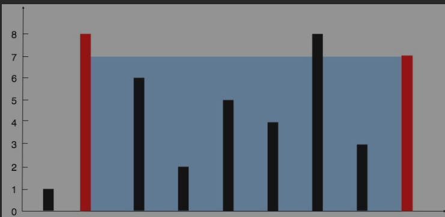

this problem is same to `Trapping Rain Water`, but with a litter difference.

 这道题，除了容器两边的墙外，其他的墙是不占体积的。但是`Trapping Rain Water`的墙占用体积
 
 

而 src\LeetCode_Java\Greedy\Trapping_Rain_Water\Trapping_Rain_Water.java
这道题就不能每次loop都计算出来当前总共能存多少water

一次loop，只能计算出leftMax~left, right ~ rightMax  这两段的存水量