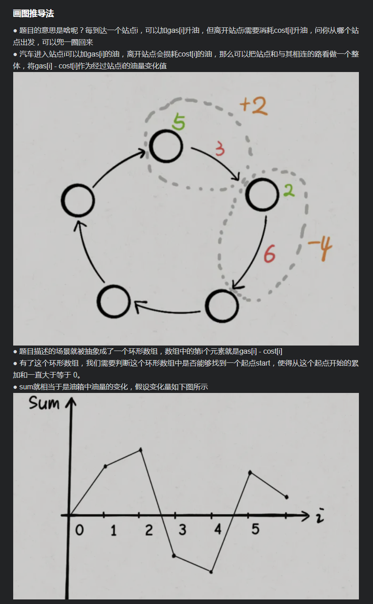
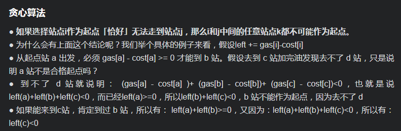

# [LeetCode 134. Gas Station](https://leetcode-cn.com/problems/gas-station/)

## Methods

### Method 1

* `Time Complexity`:
* `Space Complexity`:
* `Intuition`:
* `Key Points`:
* `Algorithm`:




### Code1

* `Code Design`:

```javascript
package LeetCode_Java.Greedy.Gas_Station;
/**
 * @param {number[]} gas
 * @param {number[]} cost
 * @return {number}
 */
var canCompleteCircuit = function (gas, cost) {
  let n = gas.length;
  // 相当于图像中的坐标点和最低点
  let sum = 0,
    // 达到最低点 start就是对应的结果
    minSum = Number.MAX_VALUE;
  let start = 0;
  for (let i = 0; i < n; i++) {
    sum += gas[i] - cost[i];
    if (sum < minSum) {
      // 经过第 i 个站点后，使 sum 到达新低
      // 所以站点 i + 1 就是最低点（起点）
      start = i + 1;
      minSum = sum;
    }
  }
  // 总油量小于总的消耗，无解
  if (sum < 0) {
    return -1;
  }
  // 环形数组特性
  return start == n ? 0 : start;
};

```

## Reference1

作者：angela-x
链接：https://leetcode-cn.com/problems/gas-station/solution/tan-xin-suan-fa-he-hua-tu-tui-dao-fa-lia-bk18/
来源：力扣（LeetCode）
著作权归作者所有。商业转载请联系作者获得授权，非商业转载请注明出处。


----------------------

### Method 2

* `Time Complexity`:
* `Space Complexity`:
* `Intuition`:
* `Key Points`:
* `Algorithm`:



### Code2

* `Code Design`:

```javascript
/**
 * @param {number[]} gas
 * @param {number[]} cost
 * @return {number}
 */
var canCompleteCircuit = function (gas, cost) {
  let n = gas.length;
  let sum = 0;
  for (let i = 0; i < n; i++) {
    sum += gas[i] - cost[i];
  }
  if (sum < 0) {
    // 总油量小于总的消耗，无解
    return -1;
  }
  // 记录油箱中的油量
  let tank = 0;
  // 记录起点
  let start = 0;
  /**
   * 如果发现从i出发无法走到j，那么i以及i, j之间的所有站点都不可能作为起点。
   */
  for (let i = 0; i < n; i++) {
    tank += gas[i] - cost[i];
    if (tank < 0) {
      // 无法从 start 走到 i
      // 所以站点 i + 1 应该是起点
      tank = 0;
      start = i + 1;
    }
  }
  return start == n ? 0 : start;
};

```

## Reference2

作者：angela-x
链接：https://leetcode-cn.com/problems/gas-station/solution/tan-xin-suan-fa-he-hua-tu-tui-dao-fa-lia-bk18/
来源：力扣（LeetCode）
著作权归作者所有。商业转载请联系作者获得授权，非商业转载请注明出处。

