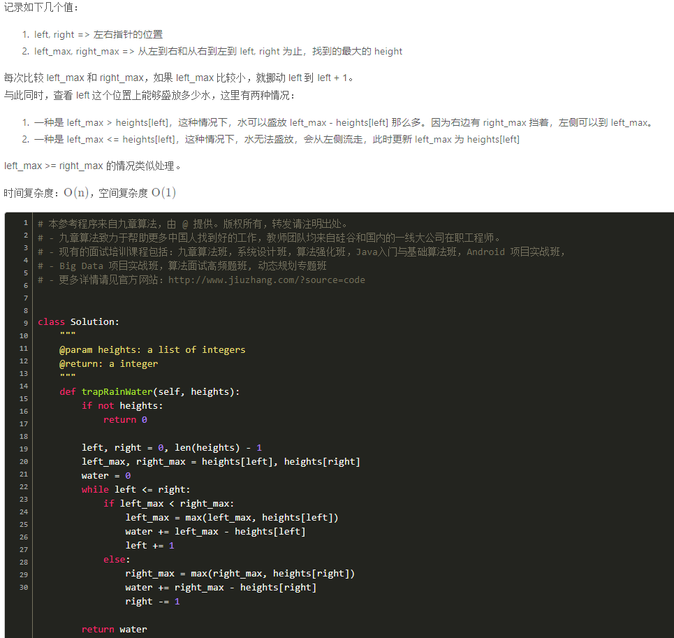

1. 做该题之前，建议先做`container with most water`

2. 
该题不能像`container with most water`一样，每次loop都能计算出来当前left, right为容器两边的壁时候，总共能存多少water

3. 
该题只能每次loop，计算出 leftMax 到left, right ~ rightMax  这两段的存水量

rightMax,leftMax --当前左右挡板
left,right --遍历过程的当前位置
当前位置能存多少水： leftMax - heights[left], rightMax - heights[right]

4. 

brute force, dp: https://www.youtube.com/watch?v=StH5vntauyQ

two pointer: https://www.youtube.com/watch?v=2LjNzbK2cmA&t=575s

