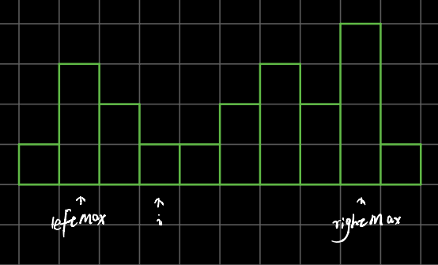

rightMax,leftMax --当前左右挡板
left,right --遍历过程的当前位置
当前位置能存多少水： leftMax - heights[left], rightMax - heights[right]

4. 


# 42. Trapping Rain Water

[LeetCode 42](https://leetcode.com/problems/trapping-rain-water/)


## Methods
[Video](https://youtu.be/hULV5F_I8EE)
this is similar with [container with most water](../Container_with_Most_Water). but, it is different.

### Method 1
Brute force: 



for every current pointer `i`, need to find left max height `leftMax` and right max height `rightMax`. Then `current water = Min(leftMax, rightMax) - heights[i]`

how to optimize it?

we could use `left` and `right` pointer instead of `i`, everytime, maintain the `leftMax` and `rightMax`, then compute the `ans` 
### Key Points
 

### Code
```java


public class Trapping_Rain_Water {
    //------do myself
    public int trapRainWater1(int[] heights) {
        if (heights.length == 0) return 0;

        int left = 0, right = heights.length - 1;
        int leftMax = heights[left], rightMax = heights[right];
        int ans = 0;
        int curLeft = 0; // the water of left pointer's position
        int curRight = 0; //the water of right pointer's position

        while (left <= right){
            if (leftMax < heights[left]) leftMax = heights[left];// update the leftMax
            if (rightMax < heights[right]) rightMax = heights[right];//update the rightMax
            curLeft = Math.min(leftMax, rightMax) - heights[left] < 0? 0 : Math.min(leftMax, rightMax) - heights[left]; // left's water
            curRight = Math.min(leftMax, rightMax) - heights[right] < 0? 0 : Math.min(leftMax, rightMax) - heights[right]; // right's water
            ans += curLeft + curRight;

            if (leftMax <= rightMax) left++;
            else right--;

        }
        return ans;
    }

    //--------------after optimizing------------------------

    public int trapRainWater(int[] heights) {
        // write your code here
        int left = 0, right = heights.length - 1;
        int leftMax = 0, rightMax = 0;
        int ans = 0;

        while (left <= right){
            if (leftMax < rightMax){
                leftMax = Math.max(leftMax, heights[left]);
                ans += leftMax - heights[left];
                left++;
            }else{
                rightMax = Math.max(rightMax, heights[right]);
                ans += rightMax - heights[right];
                right--;
            }
        }
        return ans;

    }

}


```


## Reference
[brute force, dp](https://www.youtube.com/watch?v=StH5vntauyQ)

[two pointer](https://www.youtube.com/watch?v=2LjNzbK2cmA&t=575s)              
              