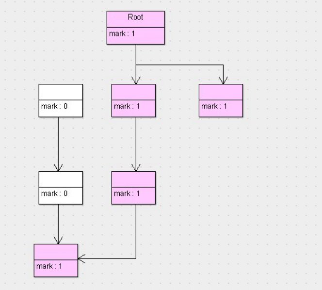

##1.引用计数法：
    https://juejin.im/post/5b701012e51d45665f300dd5
    
    1. 定义： 任何对象对A引用，A引用计数器就+1. 引用失败，A的引用计数器就-1. 计数为0可以被回收
    2. 缺点： 无法解决循环引用问题
    3. 代码实现: 
        每次 new对象，就会调用new_obj()函数：
        
        func new_obj(size){
            obj = pickup_chunk(size, $free_list)  //分配内存
            
            if(obj == NULL)
                allocation_fail()
            else
                obj.ref_cnt = 1  // 新对象第一只被分配是引用数为1
                return obj
        }
        
        
update_ptr() 函数用于更新指针 ptr，使其指向对象 obj，同时进行计数器值的增减。
        
        func update_ptr(ptr, obj){
            inc_ref_cnt(obj)     // obj 引用计数+1
            dec_ref_cnt(*ptr)    // ptr之前指向的对象(*ptr)的引用计数-1
            *ptr = obj
        }
        
        这里 update_ptr 为什么需要先调用 inc_ref_cnt，再调用dec_ref_cnt呢？
          
        是因为有可能 *ptr和 obj 可能是同一个对象，如果先调用dec_ref_cnt可能会误伤。
  
这里inc_ref_cnt函数只对对象 obj 引用计数+1        
        
        func inc_ref_cnt(obj){
            obj.ref_cnt++
        }
        
这里 dec_ref_cnt 函数会把之前引用的对象进行-1 操作，如果这时对象的计数器变为0，说明这个对象是一个垃圾对象，需要销毁，那么被它引用的对象的计数器值都需要相应的-1。
        
        func dec_ref_cnt(obj){
            obj_ref_cnt--
            if(obj.ref_cnt == 0)
                for(child : children(obj))
                    dec_ref_cnt(*child)  // 递归将被需要销毁对象引用的对象计数-1
            reclaim(obj)
        }

        

        
   
    
    

##2. 标记清楚法：解决循环引用问题
    1. 是将垃圾回收分为2个阶段：
        1. 标记: 从根节点开始标记引用的对象    
        2. 清除: 未被标记引用的对象，被清除
  
           
           
##3.     
    

    