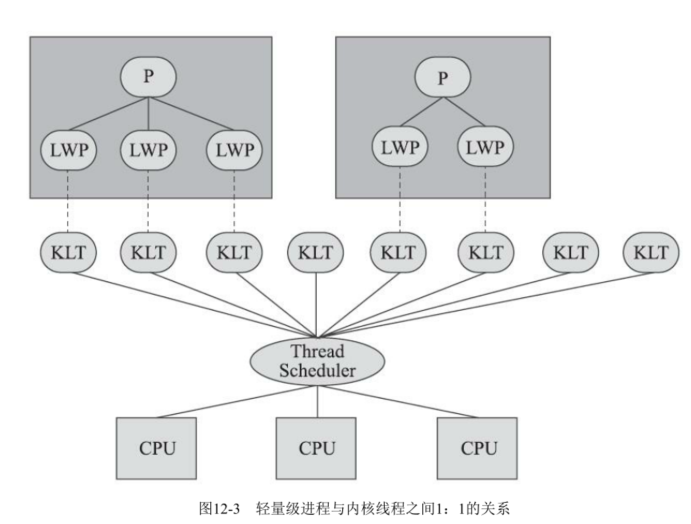
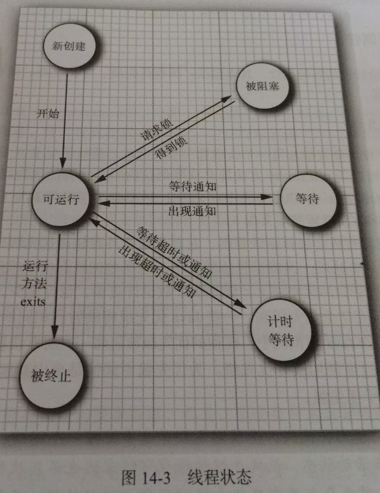

##Java内存模型: 
    1. 定义： 用来屏蔽各种硬件和操作系统的内存访问差异，以实现让Java程序在各种平台下都能达到一致的内存访问效果。
    2. Java内存模式规定了所有变量都储存在主内存，然后每个线程有自己的工作内存，线程工作内存互不干扰

    
    3. 这里所讲的主内存、工作内存与第2章所讲的Java内存区域中的Java堆、栈、方法区等并不是同一
    个层次的对内存的划分，这两者基本上是没有任何关系的。如果两者一定要勉强对应起来，那么从变
    量、主内存、工作内存的定义来看，主内存主要对应于Java堆中的对象实例数据部分
    [4]，而工作内存则对应于虚拟机栈中的部分区域。
    
    4. 关于主内存与工作内存之间具体的交互协议，即一个变量如何从主内存拷贝到工作内存、如何从
       工作内存同步回主内存这一类的实现细节，Java内存模型中定义了以下8种操作来完成

    
    5. Volatile
        1. 当一个变量被定义成volatile之后，它将具备两项特性：第一项是保证此变量对所有线程的可见
           性，这里的“可见性”是指当一条线程修改了这个变量的值，新值对于其他线程来说是可以立即得知
           的。而普通变量并不能做到这一点，普通变量的值在线程间传递时均需要通过主内存来完成。
           
        2. 当一个变量被定义成volatile之后，它将具备两项特性：第一项是保证此变量对所有线程的可见
          性，这里的“可见性”是指当一条线程修改了这个变量的值，新值对于其他线程来说是可以立即得知
          的。而普通变量并不能做到这一点，普通变量的值在线程间传递时均需要通过主内存来完成。比如
    
    
    6. 原子性，可见性和有序性
        Java内存模型是围绕着在并发过程中如何处理原子性、可见性和有序性这三个特征来建立的
        
        1. 可见性： 除了volatile之外，Java还有两个关键字能实现可见性，它们是synchronized和final。同步块的可见
                性是由“对一个变量执行unlock操作之前，必须先把此变量同步回主内存中（执行store、write操
                作）”这条规则获得的。

##线程
    1. 实现线程主要有三种方式：使用内核线程实现（1：1实现），使用用户线程实现（1：N实现），
       使用用户线程加轻量级进程混合实现（N：M实现）
   
        1. 内核线程实现：（1：1） 就是直接由操作系统内核（Kernel，下称内核）支持的线程，这种线程由内核来完成线程切换，内核通过操纵调度器（Scheduler）对线程进行调度，并负责将线程的任务映射到各个处理器上。
        但是程序一般不用直接的内核线程，而是内核线程的一种高级接口--轻量级进程。一个内核线程支持一个轻量级进程。
        其中某一个轻量级进程在系统调用中被阻塞了，也不会影响整个进程继续工作
        
        但是由于是基于内核线程实现的，需要在用户态（User Mode）和内核态（Kernel Mode）中来回切换。其次，每个轻量级进程都需要有一个内核线程的支持，因此轻量级进程要消耗一定的内核资源

        
        2. 用户线程实现：（1：N）
            1. 完全建立在用户空间的线程库上，用户线程的建立、同步、销毁和调度完全在用户态中完成，不需要内核的帮助.
            2. 不需要切换到内核态，快速且低耗
            3. 支持规模更大的线程数量
        
        3. 混合实现（N:M）：既存在用户线程，也存在轻量级进程。
            1. 优点
                这样用户线程的创建、切换、析构等操作依然廉价，并且可以支持大规模的用户线程并发。
                而操作系统支持的轻量级进程则作为用户线程和内核线程之间的桥梁，大大降低了整个进程被完全阻塞的风险。
                
        4. Java线程实现：
            1. 从 JDK 1.3开始，基本采用基于操作系统原生线程模型来实现，即1：1
            2. 以HotSpot为例， 它的每一个Java线程都是直接映射到一个操作系统原生线程来实现的，而且中间没有额外的间接结构
            3. 操作系统支持怎样的线程模型，在很大程度上会影响上面的Java虚拟机的线程是怎样映射的
            
    2. 系统调度： 系统为线程分配处理器使用权的过程
        1. 协同式调度：线程自己决定运行时长，自己运行完了通知系统进行切换。因为线程运行时间不确定，可能堵塞
        2. 抢占式调度： 每个线程将由系统来分配执行时间，线程的切换不由线程本身来决定
        3. Java采用抢占式
        4. 虽然Java调度通过系统自动，但是可以配置建议操作系统给某些线程多分配一点时间，这项操作通过设置 **线程优先级** 完成
        5. Java有十个优先级，Windows自己七个
        6. 不能依赖优先级调节，因为操作系统会根据自身改变线程优先级。 如在Windows系统存在一个叫“优先级推进器”的功能
        
##Java线程
    1. 6种线程状态： 新建，运行，无期限等待，期限等待，阻塞，结束    
    2. 创建多线程的两种方法：
        1. 继承Thread,重新run方法
        2. 实现Runnable接口，重写run方法
    3. run()和start()方法区别：
        run():仅仅是封装被线程执行的代码，直接调用是普通方法
        start():首先启动了线程，然后再由jvm去调用该线程的run()方法
    
    4. 一般使用Runnable接口:
        1. 避免java中的单继承的限制
        2. 应该将并发运行任务和运行机制解耦??什么意思

https://mp.weixin.qq.com/s?__biz=MzI4Njg5MDA5NA==&mid=2247484190&idx=1&sn=ab7301e393aa7762be9ef80d30c5fb7a&chksm=ebd7421fdca0cb09f4a880064a8610416df414ea25284e6d5142ea659e4e7e669632cfed4050&scene=21###wechat_redirect        
    
    5. 给线程设置名字
        Thread thread1 = new Thread(myThread, "关注公众号Java3y");
    
    6. 守护线程： 为其他线程服务的线程（垃圾回收就是守护线程）
        1. 特点
            1. 当别的用户线程执行结束，虚拟机就会退出，守护线程也就会被停止掉。
            2. 服务线程，没有服务对象就没有必要继续运行
            
        2. // 设置为守护线程   thread2.setDaemon(true);
        
    7. 优先级：默认为5，总共10个优先级
     
    8. 线程状态
 
    
    9. sleep状态

    10. yield方法： 让别的线程先执行
        不能保证真正退出
        
    11. join方法：
        1. 定义： 调用join方法，会等待该线程执行完毕后才执行别的线程
        2. 循环调用wait方法，直到该线程终止后调用notifyAll方法来唤醒
    
    12. stop方法：过时
        1. 一个线程A终止掉另一个线程B。 被终止的线程B会立即释放锁，这可能会让对象处于不一致的状态。
        2. 所以过时
    13. interrupt方法：替代stop方法
        1. 不会真正停止一个线程，它仅仅是给这个线程发了一个信号告诉它，它应该要结束了(明白这一点非常重要！)
        
        2. 具体到底中断还是继续运行，应该由被通知的线程自己处理
        
        Thread t1 = new Thread( new Runnable(){
            public void run(){
                // 若未发生中断，就正常执行任务
                while(!Thread.currentThread.isInterrupted()){
                    // 正常任务代码……
                }
                // 中断的处理代码……
                doSomething();
            }
        } ).start();
        
        3. 当线程正在执行sleep，wait方法，调用interrupt会抛出异常

##解决线程安全问题  
    1. 解决办法：
        1. 无状态(没有共享变量)
           
        2. 使用final使该引用变量不可变(如果该对象引用也引用了其他的对象，那么无论是发布或者使用时都需要加锁)
           
        3. 加锁(内置锁，显示Lock锁)
           
        4. 使用JDK为我们提供的类来实现线程安全(此部分的类就很多了)
           · 原子性（就比如上面的count++操作，可以使用AtomicLong来实现原子性，那么在增加的时候就不会出差错了！)
           · 容器(ConcurrentHashMap等等…)
           
    2. 原子性：一个操作不能再分 
        Java的atomic包提供给我们各种原子性操作
    3. 可见性：
        1. 当这个变量修改时，所有的线程都会知道该变量被修改了，也就是所谓的“可见性”
        2. volatile仅仅用来保证该变量对所有线程的可见性，但不保证原子性
    
    4. 不变性： 不变的变量一定线程安全
        · final修饰就是线程安全的
    
    5. 在多线程环境，只要不使用成员变量(不共享数据),就不会出现线程安全问题。
    servelt所有数据是在方法上操作的（栈封闭），就不存在线程安全问题

##Java锁机制
    ·   Synchronized 
    ·   lock
    
    1. Synchronized： 
    · 修饰普通方法，代码块，静态方法
    
        1. 它是互斥锁： 互斥锁--一次只能允许一个线程进入被锁住的代码块
        2. 它是一种内置锁/监视器锁： Java中每个对象都有一个内置锁(监视器,也可以理解成锁标记)，而synchronized就是使用对象的内置锁(监视器)来将代码块(方法)锁定的！
        
        3. 作用原理：  synchronized底层是是通过monitor对象，对象有自己的对象头，存储了很多信息，其中一个信息标示是被哪个线程持有。
        
        4. 修饰静态方法用的是类锁，修饰对象用的对象锁。他俩并不会产生线程冲突
        5. invokes 一个synchronized method， it automatically acquires the intrinsic lock for that method's object and releases it when the method returns. 
        
    
    2. Lock锁
        1. 特点：
            1. 更加灵活，例如访问一串数据，ABCD..当访问B时候可以释放A，当访问C时候可以释放B...
            2. 允许多个读线程同时访问共享资源
            3. 必须手动释放锁
        
        2. 公平锁，非公平锁
            1. 公平锁： 线程将按照它们发出请求的顺序来获取锁
            2. 非公平锁： 线程发出请求的时可以“插队”获取锁
            3. lock和synchronize 都是使用非公平锁      
            
    3. lock的子类都是基于AQS实现的：https://github.com/Snailclimb/JavaGuide/blob/master/docs/java/Multithread/AQS.md
        1. AQS： AbstractQueuedSynchronizer简称为AQS  
        
        2. AQS 核心思想是，如果被请求的共享资源空闲，则将当前请求资源的线程设置为有效的工作线程，并且将共享资源设置为锁定状态。
        如果被请求的共享资源被占用，那么就需要一套线程阻塞等待以及被唤醒时锁分配的机制，这个机制 AQS 是用 CLH 队列锁实现的，即将暂时获取不到锁的线程加入到队列中。          

        

##悲观锁和乐观锁
    1. 悲观锁： 每次去拿数据的时候都认为别人会修改，所以每次在拿数据的时候都会上锁，这样别人想拿这个数据就会阻塞直到它拿到锁
        · synchronize是悲观锁
    
    2. 乐观锁：    总是假设最好的情况，每次去拿数据的时候都认为别人不会修改，所以不会上锁，但是在更新的时候会判断一下在此期间别人有没有去更新这个数据
        · 基于CAS：
        
        1. CAS算法涉及到三个操作数
            1. 需要读写的内存值 V
            2. 进行比较的值 A
            3. 拟写入的新值 B

##分布式锁
    1. 实现方法： 
        1. 数据库
        2. Redis分布式锁
        3. Zookeeper分布式锁
        
    2. Redis 实现原理：
        1. 它是单线程，即一个线程处理所有网络请求，其他模块仍用了多个线程。
        2. 通过"setnx key value" 操作设置一个key进去，返回1代表能拿到锁，进行后续操作。返回0就代表不能拿到锁。
        3. 删除key释放锁
        4. 为了避免死锁问题：
            1. 设置超时时间，超过时间释放锁
            2. 将删除key权限交给其他服务器
    
    3. Zookeeper实现原理：
        1. 创建结点： 四种
            · 持久性节点
            · 持久性顺序节点
            · 临时性节点
            · 临时性顺序节点
        
        2. 服务器1创建结点，获取锁，服务器2再创建相同锁就会发现是失败，只能监听
        3. 服务器1处理完后，删除结点，服务器2收到通知，创建相同结点，处理，再删除
        4. 防止死锁，用临时性节点：客户端断开，节点就会自动删除
        5. 防止惊群效应，采用临时顺序性结点：每个节点监听自己前面的结点，而不是都监听服务器1的结点
        