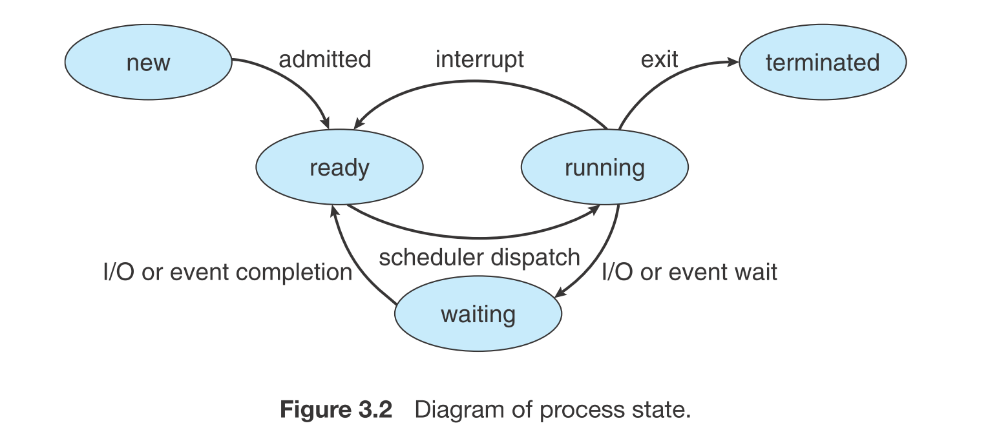

## Processes 

### Process Concept
* A process is an instance of a program in execution
* Process memory is divided into four sections as shown in Figure 3.1 below:
    * The text section comprises the compiled program code, read in from non-volatile storage when the program is launched.
    * The data section stores global and static variables, allocated and initialized prior to executing main.
    * The heap is used for dynamic memory allocation, and is managed via calls to new, delete, malloc, free, etc.
    * The stack is used for local variables. Space on the stack is reserved for local variables when they are declared ( at function entrance or elsewhere, depending on the language ), and the space is freed up when the variables go out of scope. Note that the stack is also used for function return values, and the exact mechanisms of stack management may be language specific.
    * Note that the stack and the heap start at opposite ends of the process's free space and grow towards each other. If they should ever meet, then either a stack overflow error will occur, or else a call to new or malloc will fail due to insufficient memory available.
* When processes are swapped out of memory and later restored, additional information must also be stored and restored. Key among them are the program counter and the value of all program registers.

### Process State 
* Processes may be in one of 5 states, as shown
`New` - The process is in the stage of being created.
`Ready` - The process has all the resources available that it needs to run, but the CPU is not currently working on this process's instructions.
`Running` - The CPU is working on this process's instructions.
`Waiting` - The process cannot run at the moment, because it is waiting for some resource to become available or for some event to occur. For example the process may be waiting for keyboard input, disk access request, inter-process messages, a timer to go off, or a child process to finish.
`Terminated` - The process has completed.

### Process Control Block 
For each process there is a Process Control Block, PCB, which stores the following ( types of ) process-specific information, as illustrated in Figure 3.1

`Process State` - Running, waiting, etc., as discussed above.
`Process ID`, and parent process ID.
`CPU registers and Program Counter` - These need to be saved and restored when swapping processes in and ou of the CPU.
`CPU-Scheduling information` - Such as priority information and pointers to scheduling queues.
`Memory-Management information` - E.g. page tables or segment tables.
`Accounting information` - user and kernel CPU time consumed, account numbers, limits, etc.
`I/O Status information` - Devices allocated, open file tables, etc.