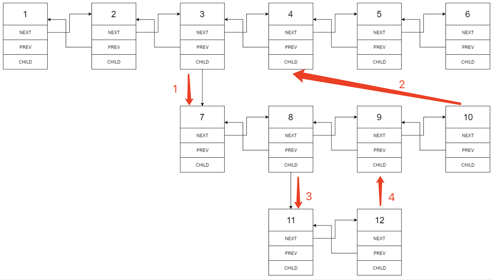

# [LeetCode 430. Flatten a Multilevel Doubly Linked List](https://leetcode-cn.com/problems/flatten-a-multilevel-doubly-linked-list/)

## Methods

当我们遍历到某个节点 `node` 时，如果它的 `child` 成员不为空，那么我们需要将 `child` 指向的链表结构进行扁平化，并且插入 `node` 与 `node` 的下一个节点之间。

### Method 1

* `Time Complexity`: O(n^2)
* `Space Complexity`:O(n)
* `Intuition`: DFS
* `Key Points`:
* `Algorithm`:


递归处理节点的顺序


### Code1

* `Code Design`:

```javascript
class Solution {
    public Node flatten(Node head) {
        Node dummy = new Node(0);
        dummy.next = head;
        while (head != null) {
            if (head.child == null) {
                head = head.next;
            } else {
                Node tmp = head.next;
                Node chead = flatten(head.child);
                head.next = chead;
                chead.prev = head;
                head.child = null;
                while (head.next != null) head = head.next;
                head.next = tmp;
                if (tmp != null) tmp.prev = head;
                head = tmp;
            }
        }
        return dummy.next;
    }
}

```

## Reference1

[leetcode ans](https://leetcode-cn.com/problems/flatten-a-multilevel-doubly-linked-list/solution/gong-shui-san-xie-yi-ti-shuang-jie-di-gu-9wfz/)

----------------------

### Method 2

* `Time Complexity`: O(n)
* `Space Complexity`: O(n)
* `Intuition`:
* `Key Points`:
* `Algorithm`:


### Code2

* `Code Design`:

```java
class Solution {
    public Node flatten(Node head) {
        dfs(head);
        return head;
    }
    Node dfs(Node head) {
        Node last = head;
        while (head != null) {
            if (head.child == null) {
                last = head;
                head = head.next;
            } else {
                Node tmp = head.next;
                Node childLast = dfs(head.child);
                // 连接 head和child Head
                head.next = head.child;
                head.child.prev = head;
                head.child = null;
                // 连接 child tail 和 head.next
                if (childLast != null) childLast.next = tmp;
                if (tmp != null) tmp.prev = childLast;
                // 更新last
                last = head;
            }
        }
        return last;
    }
}
```

----------------------

### Method 3

* `Time Complexity`: O(n)
* `Space Complexity`:
* `Intuition`:
* `Key Points`:
* `Algorithm`:

迭代遍历顺序




### Code3

* `Code Design`:

```java
class Solution {
    public Node flatten(Node head) {
        Node dummy = new Node(0);
        dummy.next = head;
        for (; head != null; head = head.next) {
            if (head.child != null) {
                Node tmp = head.next;
                Node child = head.child;
                head.next = child;
                child.prev = head;
                head.child = null;
                Node last = head;
                while (last.next != null) last = last.next;
                last.next = tmp;
                if (tmp != null) tmp.prev = last;
            }
        }
        return dummy.next;
    }
}

```
