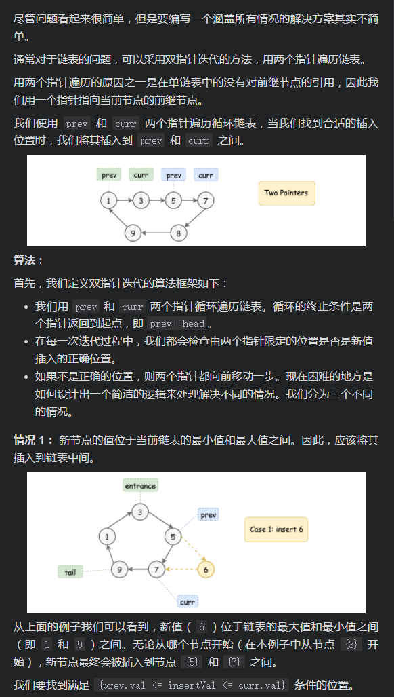
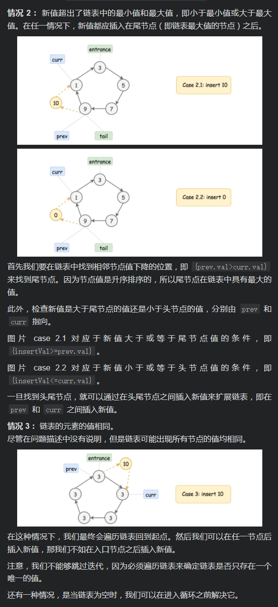

# [LeetCode 708. Insert into a Sorted Circular Linked List](https://leetcode-cn.com/problems/insert-into-a-sorted-circular-linked-list/)

## Methods

### Method 1

* `Time Complexity`:
* `Space Complexity`:
* `Intuition`:
* `Key Points`:
* `Algorithm`:




### Code1

* `Code Design`:

```python
"""
# Definition for a Node.
class Node:
    def __init__(self, val=None, next=None):
        self.val = val
        self.next = next
"""

class Solution:
    def insert(self, head: 'Node', insertVal: int) -> 'Node':
        if head is None:
            head = Node(insertVal)
            head.next = head
            return head

        cur = head
        # 保证只遍历一遍
        while cur.next != head:
            # insertVal最大
            # cur > cur.next 保证了cur为最后一个节点
            if cur.val > cur.next.val and insertVal >= cur.val and insertVal > cur.next.val:
                break
            # insertVal最小
            elif cur.val > cur.next.val and insertVal < cur.val and insertVal <= cur.next.val:
                break
            elif insertVal >= cur.val and insertVal <= cur.next.val:
                break
            else:
                cur = cur.next

        nextNode = cur.next
        cur.next = Node(insertVal, cur.next)
        return head
```

## Reference1


