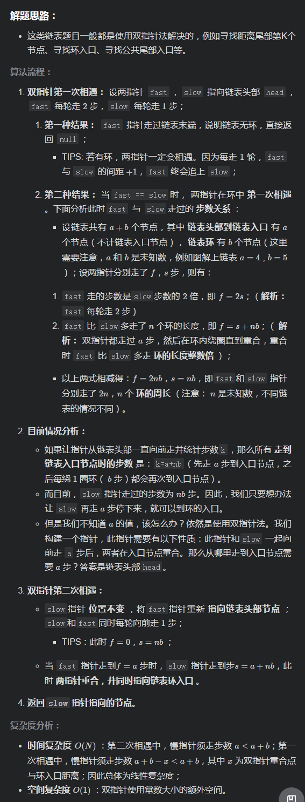

# [LeetCode 142. Linked List Cycle II](https://leetcode-cn.com/problems/linked-list-cycle-ii/)

## Methods

### Method 1

* `Time Complexity`:
* `Space Complexity`:
* `Intuition`:
* `Key Points`:
* `Algorithm`:



### Code1

* `Code Design`:

自己写的:

```javascript
/**
 * @param {ListNode} head
 * @return {ListNode}
 */
var detectCycle = function(head) {
    let fast = head, slow = head;
    while (fast && fast.next) {
        slow = slow.next;
        fast = fast.next.next;
        if (fast === slow) break;
    }
    if (fast == null || fast.next == null) return null;

    fast = head;
    while (fast !== slow) {
        fast = fast.next;
        slow = slow.next;
    }
    return fast;
};

```

### Code2

* `Code Design`:

答案

```java
public class Solution {
    public ListNode detectCycle(ListNode head) {
        ListNode fast = head, slow = head;
        while (true) {
            if (fast == null || fast.next == null) return null;
            fast = fast.next.next;
            slow = slow.next;
            if (fast == slow) break;
        }
        fast = head;
        while (slow != fast) {
            slow = slow.next;
            fast = fast.next;
        }
        return fast;
    }
}
```

## Reference2

[leetcode ans](https://leetcode-cn.com/problems/linked-list-cycle-ii/solution/linked-list-cycle-ii-kuai-man-zhi-zhen-shuang-zhi-/)