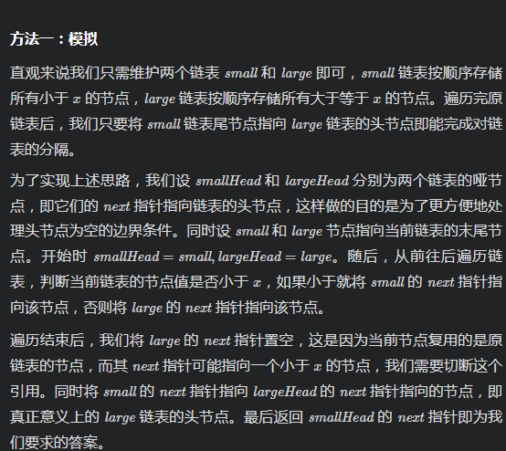

# [LeetCode 86. Partition List](https://leetcode-cn.com/problems/partition-list/)

## Methods

### Method 1

* `Time Complexity`:
* `Space Complexity`:
* `Intuition`:
* `Key Points`:
* `Algorithm`:



### Code1

* `Code Design`:

```javascript
var partition = function(head, x) {
    let small = new ListNode(0);
    const smallHead = small;
    let large = new ListNode(0);
    const largeHead = large;
    while (head !== null) {
        if (head.val < x) {
            small.next = head;
            small = small.next;
        } else {
            large.next = head;
            large = large.next;
        }
        head = head.next;
    }
    large.next = null;
    small.next = largeHead.next;
    return smallHead.next;
};
```

## Reference1

作者：LeetCode-Solution
链接：https://leetcode-cn.com/problems/partition-list/solution/fen-ge-lian-biao-by-leetcode-solution-7ade/
来源：力扣（LeetCode）
著作权归作者所有。商业转载请联系作者获得授权，非商业转载请注明出处。
