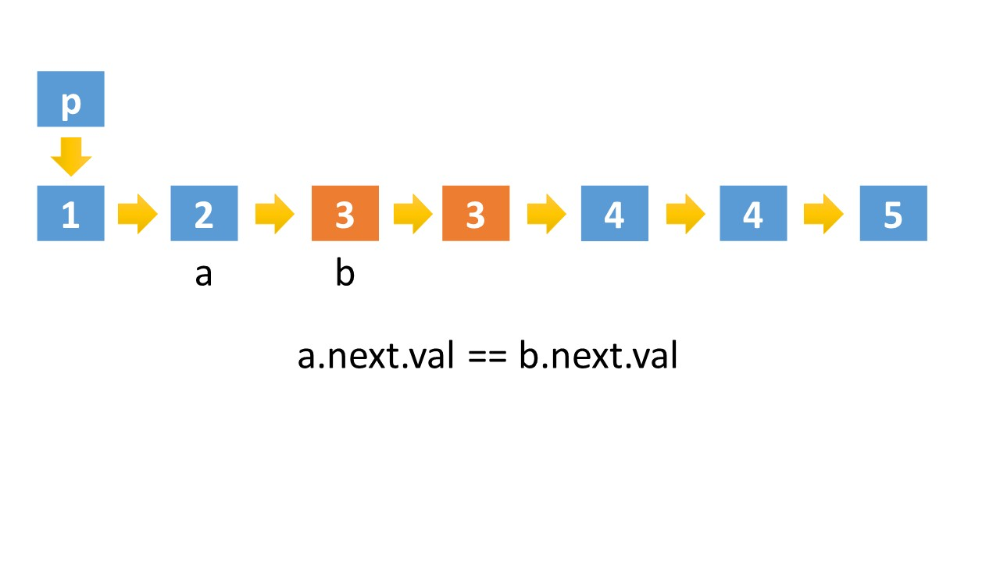
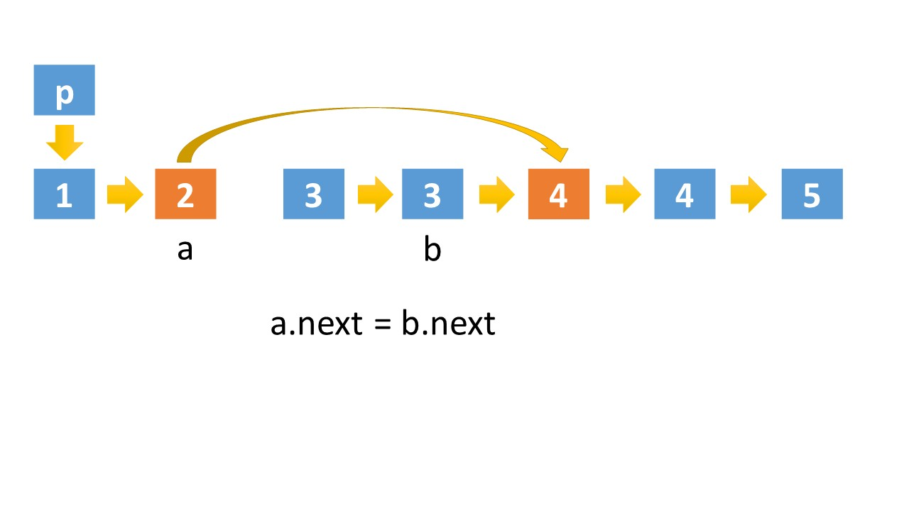

# [LeetCode 82. Remove Duplicates from Sorted List II](https://leetcode-cn.com/problems/remove-duplicates-from-sorted-list-ii/)

## Methods

### Method 1

* `Time Complexity`:
* `Space Complexity`:
* `Intuition`:
* `Key Points`:
* `Algorithm`:

递归, 待补充

### Code1

* `Code Design`:

```python

```

## Reference1

----------------------

### Method 2

* `Time Complexity`:
* `Space Complexity`:
* `Intuition`:
* `Key Points`:
* `Algorithm`:







### Code2

* `Code Design`:

```python
class Solution(object):
    def deleteDuplicates(self, head):
        if not (head and head.next):
            return head
        dummy = ListNode(-1)
        dummy.next = head
        a = dummy
        b = head
        while b and b.next:
            # 初始化的时a指向的是哑结点，所以比较逻辑应该是a的下一个节点和b的下一个节点
            if a.next.val!=b.next.val:
                a = a.next
                b = b.next
            else:
                # 如果a、b指向的节点值相等，就不断移动b，直到a、b指向的值不相等
                while b and b.next and a.next.val==b.next.val:
                    b = b.next
                a.next = b.next
                b = b.next
        return dummy.next

```

## Reference2

[leetcode ans](https://leetcode-cn.com/problems/remove-duplicates-from-sorted-list-ii/solution/san-chong-jie-fa-duo-tu-zhan-shi-82-shan-chu-pai-x/)

----------------------

### Method 3

* `Time Complexity`:
* `Space Complexity`:
* `Intuition`:
* `Key Points`:
* `Algorithm`:


### Code3

* `Code Design`:

```python
class Solution(object):
    def deleteDuplicates(self, head):
        if not (head and head.next):
            return head
        dummy = ListNode(-1)
        dummy.next = head
        a = dummy
        b = head.next
        while b:
            if a.next.val!=b.val:
                a = a.next
                b = b.next
            else:
                while b and a.next.val==b.val:
                    b = b.next
                # 这里的去重跟解法二有点差别，解法二的是
                # a.next = b.next
                a.next = b
                # b指针在while中判断完后，可能指向了null，这里需要处理边界问题
                b = b.next if b else None
        return dummy.next
```

## Reference2

[leetcode ans](https://leetcode-cn.com/problems/remove-duplicates-from-sorted-list-ii/solution/san-chong-jie-fa-duo-tu-zhan-shi-82-shan-chu-pai-x/)