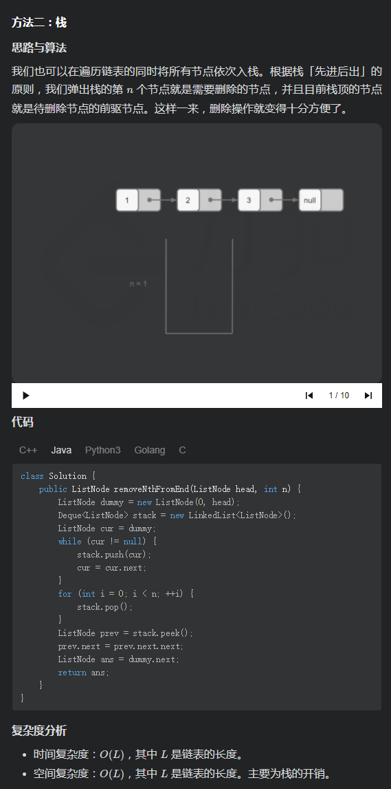

# [LeetCode 19. Remove Nth Node From End of List](https://leetcode-cn.com/problems/remove-nth-node-from-end-of-list/)

## Methods

### Method 1

* `Time Complexity`: O(n)
* `Space Complexity`: O(1)
* `Intuition`:
* `Key Points`:
* `Algorithm`:

双指针, 之所以用dummy是因为: 可能被移除的元素是 `head`

slow指向被移除的node的前一位, fast用来辅助找到slow

### Code

* `Code Design`:

```javascript
/**
 * @param {ListNode} head
 * @param {number} n
 * @return {ListNode}
 */
var removeNthFromEnd = function(head, n) {
    if (head.next === null && n > 1) return null;
    if (head.next === null && n === 1) return null;
    const dummy = new ListNode();
    dummy.next = head;
    let slow = dummy, fast = dummy;
    for (let i = 0; i < n; i++) {
        fast = fast.next;
    }
    while (fast && fast.next !== null) {
        slow = slow.next;
        fast = fast.next;
    }

    const removedNode = slow.next;
    slow.next = slow.next.next;
    removedNode.next = null;

    return dummy.next;
};

```

----------------------

### Method 2

* `Time Complexity`: O(n)
* `Space Complexity`: O(n)
* `Intuition`: Stack
* `Key Points`:
* `Algorithm`:



## Reference

[leetcode ans](https://leetcode-cn.com/problems/remove-nth-node-from-end-of-list/solution/shan-chu-lian-biao-de-dao-shu-di-nge-jie-dian-b-61/)