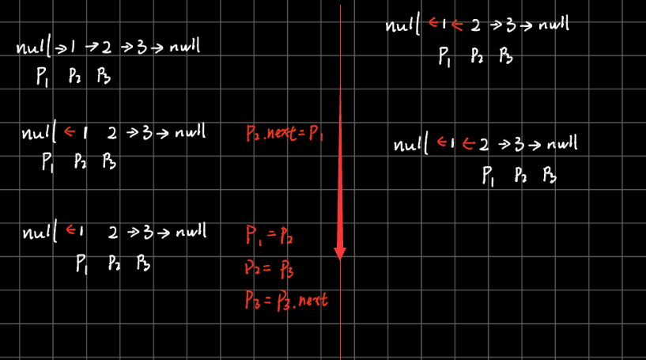

# 206. Reverse Linked List

[LeetCode 206](https://leetcode.com/problems/reverse-linked-list/)


## Methods

### Method 1
use 3 pointers to reverse

### Key Points
the third point is used for moving of the second pointer 


### Code
```java
class Solution {
    public ListNode reverseList(ListNode head) {
        if (head == null || head.next == null) return head; 
        
        ListNode p1 = null; 
        ListNode p2 = head;
        
        
        while (p2 != null){
            ListNode p3 = head.next;
            //change direct 
            p2.next = p1; 
            
            //move pointer 
            p1 = p2; 
            p2 = p3;
             
        }
        //in the end, don't forget the last node 
        p2.next = p1; 
        
        return p2;
    }
}
```
after optimize 
```java

class optimize{
    //---------------after optimize
    public ListNode reverse(ListNode head) {
        if (head.next == null) return head; 
        
        
        ListNode p1 = null;
        ListNode p2 = head;
        while (p2 != null) {
            //temp记录下一个节点，head是当前节点
            ListNode p3 = p2.next;
            p2.next = p1;
            p1 = p2;
            p2 = p3;
        }
        return p1;
    }

}

```
### Method 2
using recursive method

### Key Points
every level, need to do 3 steps:


I. change `curNode.next.next`


```
from 

curNode -> curNode.next->

to
 
    curNode     ->    curNode.next
                <-
```

II. then let curNode points to null:
  ```
  from
   
      curNode     ->    curNode.next
                  <-

  to 
       curNode     <-    curNode.next
                   

  ```  
III. In the end, return the last node of the LinkedList.

### Code
```java
public class Solution {
    public ListNode reverse(ListNode head) {
        if (head.next == null) return head;
        ListNode tail = reverse(head.next); // 姑且相信递归可以把后面的都搞定，并且找到最后那个节点
        head.next.next = head; // 后面翻转后最后的尾巴应该指向当前的头，而尾巴不就正是原来的next嘛。。。
        head.next = null; // 别忘了当前的头现在得指向null
        return tail; // 返回尾巴收工
    }
}
```


## Reference
https://leetcode.com/problems/reverse-linked-list/solution/