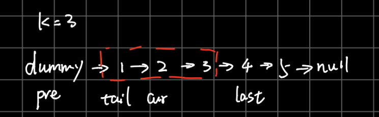

# 25.  Reverse Nodes in k-Group


[LeetCode 25](https://leetcode.com/problems/reverse-nodes-in-k-group/)


## Methods

### Method 
just like [Reverse_Linked_List_II](../Reverse_Linked_List_II), we could use `tail`, `cur`, `pre` to 
reverse the linkedlists. 

because it says "If the number of nodes is not a multiple of k then left-out nodes in the end should remain as it is."
so every loop, need `last` and `count` to confirm if the rest nodes are bigger than k. 

so need 4 variables: `last` `pre` `cur` `tail`



### Key Points
every loop, don't forget to update the pre and last; 

### Code
```java
public class Solution {
    /**
    * @param head: a ListNode
    * @param k: An integer
    * @return: a ListNode
    */
    public ListNode reverseKGroup(ListNode head, int k) {
        if (head == null || head.next == null) return head;
        
        ListNode dummy = new ListNode(0);
        dummy.next = head; 
        ListNode last = dummy, pre = dummy, tail = pre.next, cur = tail.next; 
        
        
        while(true){
            // move the last to confirm if the rest nodes are bigger than k
            int count = k;
            while (last != null && count >=0){
                last = last.next; 
                count--;
            }
            if (count >= 0 && last == null) break; 
        
            //reverse nodes between pre and last 
            tail = pre.next; 
            cur = tail.next;
            while (cur != last){
                tail.next = cur.next;
                cur.next = pre.next;
                pre.next = cur;
                
                cur = tail.next;
            }
            //update pre and last to the next loop;
            //notice that tail is the last node of the reversed linkedlist part
            pre = tail; 
            last = tail; 
        }
        
        return dummy.next;
      


    }
    

}

```


## Reference