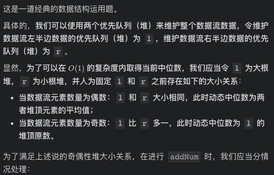

# [LeetCode 168. Excel Sheet Column Title](https://leetcode-cn.com/problems/excel-sheet-column-title/)

## Methods

### Method 1

* `Time Complexity`:
* `Space Complexity`:
* `Intuition`:
* `Key Points`:





* `Algorithm`:


### Code1

* `Code Design`:

```python
class Solution:
    def convertToTitle(self, columnNumber: int) -> str:
        ans = ''
        while columnNumber > 0:
            columnNumber -= 1
            remainder = columnNumber % 26
            ans = chr(remainder + ord('A')) + ans
            columnNumber = int(operator.truediv(columnNumber, 26))
        return ans
```

## Reference1

[leetcode ans](https://leetcode-cn.com/problems/excel-sheet-column-title/solution/xiang-xi-tong-su-de-si-lu-fen-xi-by-windliang-2/)
[leetcode ans](https://leetcode-cn.com/problems/excel-sheet-column-title/solution/gong-shui-san-xie-cong-1-kai-shi-de-26-j-g2ur/)
