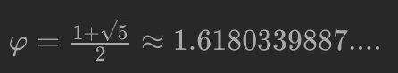

# 59. Fibonacci Number

[LeetCode 59](https://leetcode.com/problems/fibonacci-number/)


## Methods

### Method 1
* `Time Complexity`: O(1)
* `Intuition`: Using the golden ratio, a.k.a Binet's forumula: 
* `Key Points`: 
* `Algorithm`: 
use formula, Here's a [link](https://demonstrations.wolfram.com/GeneralizedFibonacciSequenceAndTheGoldenRatio/) to find out more about how the Fibonacci sequence and the golden ratio work.
Use `the golden ratio` formula to calculate the Nth Fibonacci number.

### Code
* `Code Design`: 
```java
class Solution {
    public int fib(int N) {
        double goldenRatio = (1 + Math.sqrt(5)) / 2;
        return (int)Math.round(Math.pow(goldenRatio, N)/ Math.sqrt(5));
    }
}
```


## Reference