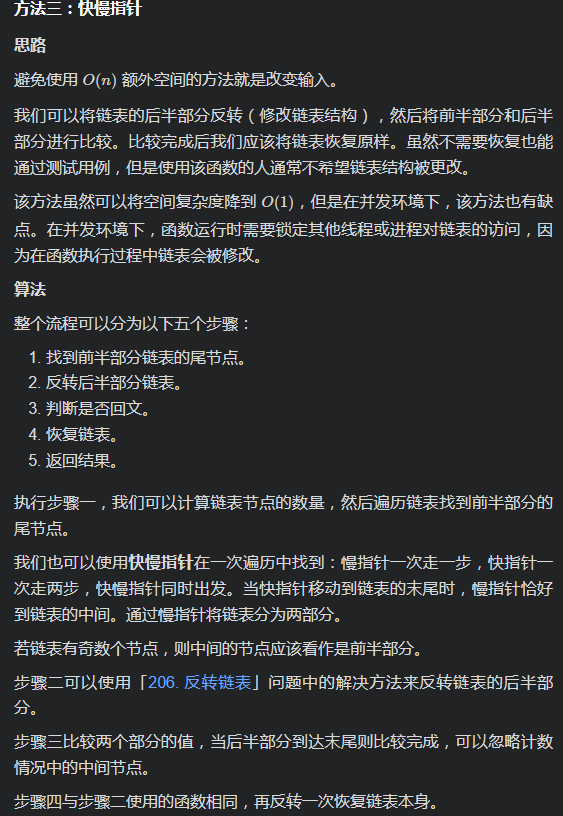

# [LeetCode 318. Maximum Product of Word Lengths](https://leetcode-cn.com/problems/maximum-product-of-word-lengths/)

## Methods

### Method 1

* `Time Complexity`: O(n^2)
* `Space Complexity`: O(n)
* `Intuition`:
* `Key Points`:
* `Algorithm`:

* 解题思路
1.先判断两个字符串是否有重复的字母
2.若没有相同的字母，则计算字母的乘积。
3.取最大的长度
* 难点：如何有效且快速的判断两个字符串是否有重复的字母 ？

解决：利用位运算。一共 26 个小写字母，而整型数一共 32 位。这里我们让整型数的每一位代表每一个字母 ，然后得到的一个整型数，它的前26位比特位用来表示字母（ 1 代表有这个字母，0 代表没有这个字母）。如 “abc” 使用 ‘111’ 即数字 7代替； “abcf” 使用‘100111’ 即数字39。最后进行数字的与运算。如果哪一位相同则说明存在重复的字母，利用`&`运算即可。再拿“abc” 和 “abcf” 举例子 ‘111’ 和 ‘100111’ 进行与运算不为零 则说明存在相同的字母。

注意坑: 


### Code

* `Code Design`:

```java

class Solution {
    public int maxProduct(String[] words) {
        int length = words.length;
        int[] ints = new int[length];
        // for循环每个word
        for (int i = 0; i < length ; i++) {
            // for循环该单词的每个字母
            for (char c : words[i].toCharArray()){
                // 将当前字母所在 二进制的位置处置为 1
                // 如当前字母为a, 则把第0为置为1; 如果当前字母为d, 则把第三位置为1
                int setBitPos = 1 << (c - 97);
                // 和该字母之前的字母合并
                ints[i] |= setBitPos;
            }
        }
        int re = 0;
        for (int i = 0; i < length -1 ; i++) {//进行整型数的比较并得出最大长度
            int pre1 = ints[i];
            for (int j = i + 1; j < length; j++) {
                int pre2 = ints[j];
                //与运算, 如果为0, 则表示没相同的字母
                // &运算要带括号
                if ((pre1 & pre2) == 0){
                    int te = words[i].length() * words[j].length();
                    re = re >= te ? re : te;
                }

            }
        }
        return re;
    }
}
```

## Reference

[leetcode ans](https://leetcode-cn.com/problems/maximum-product-of-word-lengths/solution/qiao-miao-di-shi-yong-zheng-xing-shu-de-vec14/)