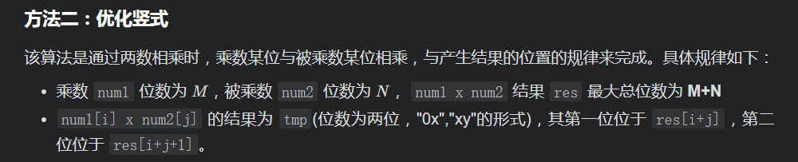
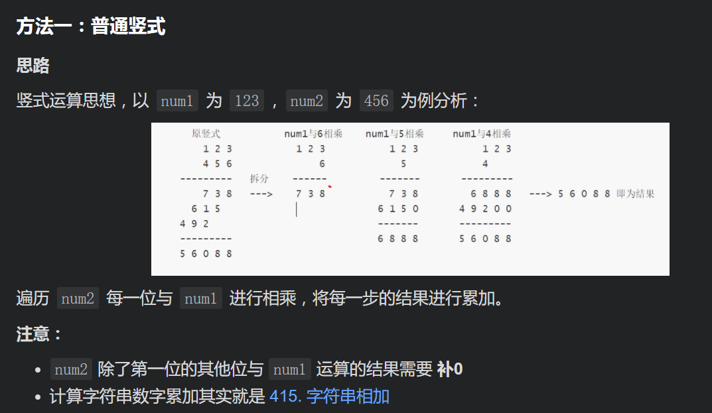

# 43. Multiply Strings

[LeetCode 43](https://leetcode.com/problems/multiply-strings/)

## Methods

### Method 1




### Key Points

1. In order to deal with `carry`, every time, put number into `i + j + 1` only.

### Code

```java
class Solution {
    public String multiply(String num1, String num2) {
        if (num1.equals("0") || num2.equals("0")) {
            return "0";
        }
        int[] res = new int[num1.length() + num2.length()];
        for (int i = num1.length() - 1; i >= 0; i--) {
            int n1 = num1.charAt(i) - '0';
            for (int j = num2.length() - 1; j >= 0; j--) {
                int n2 = num2.charAt(j) - '0';
                int sum = (res[i + j + 1] + n1 * n2);
                res[i + j + 1] = sum % 10;
                res[i + j] += sum / 10; // num2的每一位从右往左依次乘num1, 保证了结果是一个从右往左得到结果的过程, 不会出现进位问题
            }
        }

        StringBuilder result = new StringBuilder();
        for (int i = 0; i < res.length; i++) {
            if (i == 0 && res[i] == 0) continue;
            result.append(res[i]);
        }
        return result.toString();
    }
}


```

## method2



```java
class Solution {
    /**
    * 计算形式
    *    num1
    *  x num2
    *  ------
    *  result
    */
    public String multiply(String num1, String num2) {
        if (num1.equals("0") || num2.equals("0")) {
            return "0";
        }
        // 保存计算结果
        String res = "0";

        // num2 逐位与 num1 相乘
        for (int i = num2.length() - 1; i >= 0; i--) {
            int carry = 0;
            // 保存 num2 第i位数字与 num1 相乘的结果
            StringBuilder temp = new StringBuilder();
            // 补 0
            for (int j = 0; j < num2.length() - 1 - i; j++) {
                temp.append(0);
            }
            int n2 = num2.charAt(i) - '0';

            // num2 的第 i 位数字 n2 与 num1 相乘
            for (int j = num1.length() - 1; j >= 0 || carry != 0; j--) {
                int n1 = j < 0 ? 0 : num1.charAt(j) - '0';
                int product = (n1 * n2 + carry) % 10;
                temp.append(product);
                carry = (n1 * n2 + carry) / 10;
            }
            // 将当前结果与新计算的结果求和作为新的结果
            res = addStrings(res, temp.reverse().toString());
        }
        return res;
    }

    /**
     * 对两个字符串数字进行相加，返回字符串形式的和
     */
    public String addStrings(String num1, String num2) {
        StringBuilder builder = new StringBuilder();
        int carry = 0;
        for (int i = num1.length() - 1, j = num2.length() - 1;
             i >= 0 || j >= 0 || carry != 0;
             i--, j--) {
            int x = i < 0 ? 0 : num1.charAt(i) - '0';
            int y = j < 0 ? 0 : num2.charAt(j) - '0';
            int sum = (x + y + carry) % 10;
            builder.append(sum);
            carry = (x + y + carry) / 10;
        }
        return builder.reverse().toString();
    }
}
```


## Reference

[method1 video](https://www.youtube.com/watch?v=kY7SI207GAk)

作者：breezean
链接：https://leetcode-cn.com/problems/multiply-strings/solution/you-hua-ban-shu-shi-da-bai-994-by-breezean/
来源：力扣（LeetCode）
著作权归作者所有。商业转载请联系作者获得授权，非商业转载请注明出处。