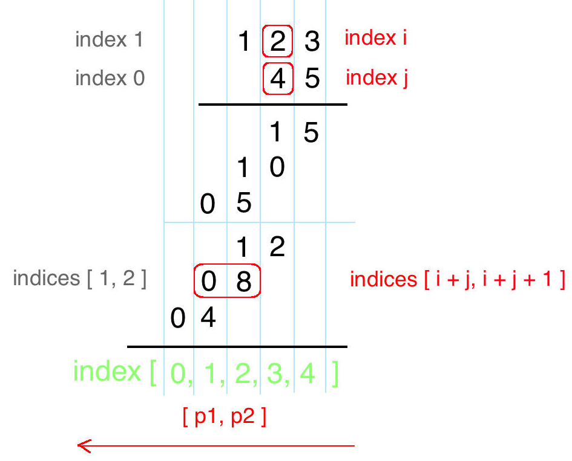

# 43. Multiply Strings

[LeetCode 43](https://leetcode.com/problems/multiply-strings/)


## Methods

### Method 1


### Key Points
1. In order to deal with `carry`, every time, put number into `i + j + 1` only. 

### Code
```java


class Solution {

    public String multiply(String num1, String num2) {
        if (num1.equals("0") || num2.equals("0")) return "0";
        
        
        int[] ans = new int[num1.length() + num2.length()]; 
        Arrays.fill(ans, 0); 
        
        for (int i = num1.length() - 1; i >= 0; i--) {
            for (int j = num2.length() - 1; j >= 0; j--) {
                
                // [ten place, one place]  -> [i + j, i + j + 1]
                int cur = (num1.charAt(i) - '0') * (num2.charAt(j) - '0'); 
                ans[i + j + 1] += cur;  
            }
        }
        //deal with extra 0, for example: ans = [0, 0, 0, 3, 2, 1] 
        //                                               end
        int end = 0; 
        while (ans[end] == 0) end++; 
        
        // traverse the int[]ans, to get string.
        int carry = 0; 
        for (int i = ans.length - 1; i >= end; i--){
            int digit = (ans[i] + carry) % 10;
            carry = (ans[i] + carry) / 10; 
            ans[i] = digit; 
        }

        if (carry > 0 && end > 0) ans[end-1] = carry; // if ans need carry to more digit        
        String s = ""; 
        for (int i = 0; i < ans.length; i++){
            if (ans[i] == 0 && i < end) continue; 
            s += String.valueOf(ans[i]);
        }
        
        return s;
    }   
}

```


## Reference
[Chinese Details](https://leetcode-cn.com/problems/multiply-strings/solution/gao-pin-mian-shi-xi-lie-zi-fu-chuan-cheng-fa-by-la/)

[English Original Version](https://leetcode.com/problems/multiply-strings/discuss/17605/Easiest-JAVA-Solution-with-Graph-Explanation)