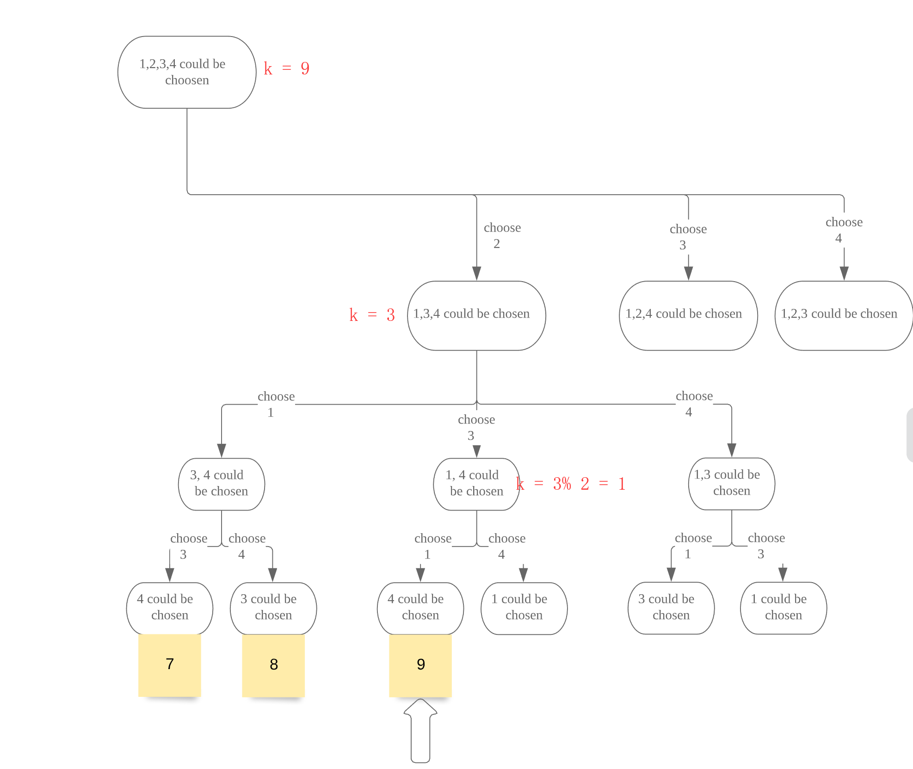

# 60. Permutation Sequence

[LeetCode 60](https://leetcode.com/problems/permutation-sequence/submissions/)


## Methods

### Method 1
* `Time Complexity`: O(n!)
* `Intuition`: backtracking
* `Algorithm`: 

### Code
```java
public class Solution {
    int count;
    
    public String getPermutation(int n, int k) {
        char[] chars = new char[n]; 
        boolean[] visited = new boolean[n];
        count = 0;
        
        for (int i = 0; i < n; i++) chars[i] = (char)('0' + i + 1);
        return dfs(n, k, visited, chars, ""); 
    }
    
    private String dfs(int n, int k,boolean[] visited, char[] chars, String path) {
        if (path.length() == n) {
            count++; 
            if (count == k) return path; 
            return ""; 
        }
        for (int i = 0;i < n;i++ ) {
            if (visited[i] == true) continue; 
            visited[i] = true; 
            String s = dfs(n, k, visited, chars, path + chars[i]); 
            if (!s.equals("")) return s; 
            visited[i] = false; 
        } 
        return "";
    }
}

```
### Method 2
* `Time Complexity`: O(n)
* `Intuition`: 
* `Algorithm`: 
    * the 1st step, need to choose which number as `1st` digit. every group has `(n-1)!` numbers,, so `the 1st digit = k / (n-1)!`.
take `n = 4, k = 9` as example. `k/(n-1)! = k/3! = 9/6 = 1..3`. so the first digit choose `2`(index is 1 we need to choose the second number). 
    * Then, we need to update `k`, because we are in the second group `choose 2`, we need update our `k` to this group, to remove previous number, and jump into this group. so `k = k % (n-1)!`
       
       
    * but notice that `k` is not index, it means the Knd number, so need to minus 1. 
    
### key points 
 * use `k / factorial` to confirm every digit, use `k % factorial` to update `k`
 * Need to calculate `n` levels down,  One level is missing from the picture but it exists
 * `f[0] = 1`, because in the leaf node, it is `k / 1` not `k / 0` 

```java
class solution{
    public String getPermutation(int n, int k) {
        int[] factorial = new int[n+1];
        StringBuffer result = new StringBuffer();
        List<Integer> nums = new LinkedList<>();
        for (int i =1; i<=9; i++){
            nums.add(i);
        }
        //calculate the factorial 
        factorial[0] =1; // 0! = 1
        for (int i=1;i<=n ;i++ ){
            factorial[i]  = factorial[i-1] * i ; // f[n] = n! 
        } 
        //fill in answer
        k -= 1;  // subtract 1 because of things always starting at 0
        for (int i =0; i <n; i++){ // Need to calculate n levels down,  One level is missing from the picture but it exists 
            int whichPart = k / factorial[n-i-1]; // whichPart = the number of cur digit
            result.append(nums.get(whichPart).toString());
            nums.remove(whichPart); // remove used number 
            k = k % factorial[n-i-1]; // update k 
        }
        return result.toString();
    }
}
```


## Reference
[explain](https://leetcode.wang/leetCode-60-Permutation-Sequence.html)

[video](https://www.youtube.com/watch?v=xdvPD1IiyUM)