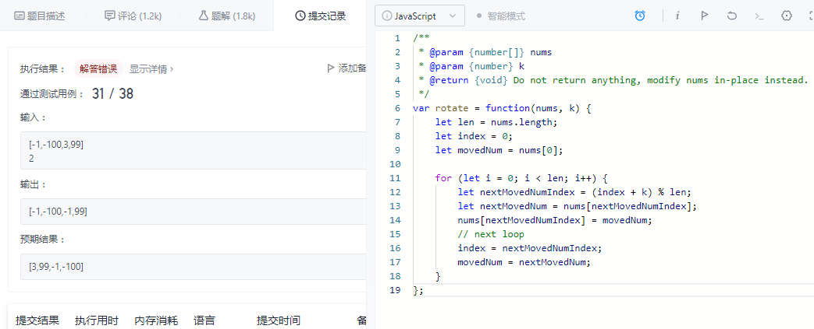
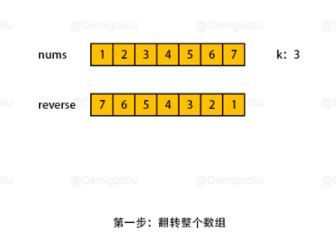
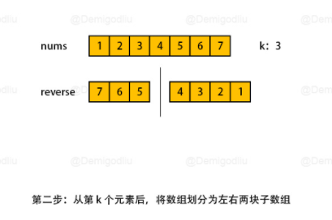
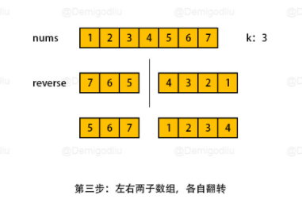
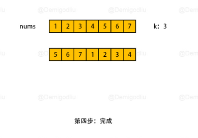

# [LeetCode 189. Rotate Array](https://leetcode-cn.com/problems/rotate-array/)

## Methods

### Method 1

* `Time Complexity`: O(n)
* `Intuition`: in place
* `Key Points`: newIndex = (index / k) % len
* `Algorithm`:

如果按照这种方法: 
每次移动一个数a到另外一个位置数b, 再移动b到其他位置c这样, 会出现edge case: 移动a到b, 经过计算,b的下一个位置在a, 这样导致a和b其实为互相调换, 而无法对其他元素进行修改

这时候引入一个变量`i`, 用来记录每次循环里面a的index, 下次循环index如果还是和i相等,就向后移动一位
`movedNum`用来记录将要被移动的元素, `nextMovedNum`用来记录将要被移动到的所在位置的元素

### Code

* `Code Design`:

```java
class Solution {
    public void rotate(int[] nums, int k) {
        int len = nums.length,n = len;
        int i = 0, index = 0, movedNum = nums[index], nextMovedNum = nums[index];

        if (k % n == 0) return;

        while (n-- != 0) {
            index =  (index + k) % len;
            nextMovedNum = nums[index];
            nums[index] = movedNum;
            movedNum = nextMovedNum;
            if (index == i) {
                index = ++i;
                movedNum = nums[index];
            }
        }
    }
}
```

### Method 2

* `Time Complexity`: O(n)
* `Intuition`: rotate array 3 times
* `Key Points`:
* `Algorithm`:






### Code

* `Code Design`:

```javascript
/**
 * @param {number[]} nums
 * @param {number} k
 * @return {void} Do not return anything, modify nums in-place instead.
 */
var rotate = function(nums, k) {
  k %= nums.length;
  reverse(nums, 0, nums.length - 1);
  reverse(nums, 0, k - 1);
  reverse(nums, k, nums.length - 1);

  return nums;
}

var reverse = function(nums, left, right) {
  while (left <= right) {
    let temp = nums[right];
    nums[right] = nums[left];
    nums[left] = temp;
    left++;
    right--;
  }
}
```

## Reference

[method2](https://leetcode-cn.com/problems/rotate-array/solution/shu-zu-fan-zhuan-xuan-zhuan-shu-zu-by-de-5937/)
