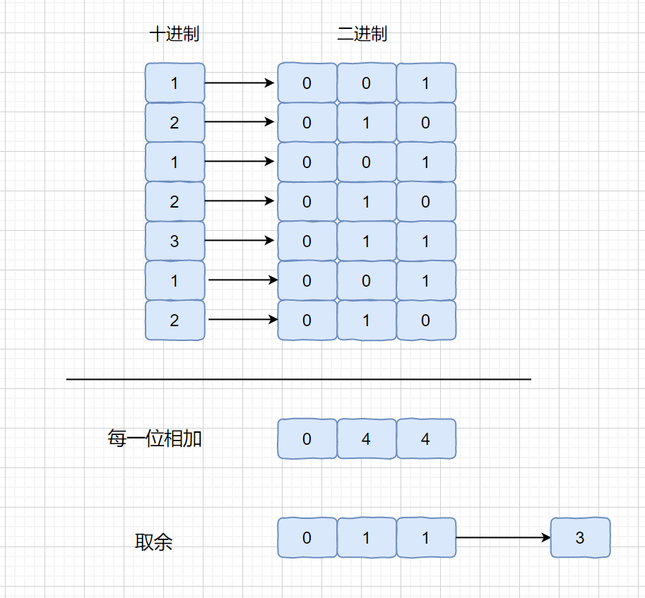

# [LeetCode 137. Single Number II](https://leetcode-cn.com/problems/single-number-ii/)

## Methods

### Method 1

* `Time Complexity`:
* `Space Complexity`:
* `Intuition`:
* `Key Points`:
* `Algorithm`:

这个方法主要做法是将我们的数的二进制位每一位相加，然后对其每一位的和除以3取余

那么我们为什么要这样做呢？大家想一下，如果其他数都出现 3 次，只有目标数出现 1 次，那么每一位的 1 的个数无非有这2种情况，为 3 的倍数（全为出现三次的数） 或 3 的倍数 +1（包含出现一次的数）。这个 3 的倍数 +1 的情况也就是我们的目标数的那一位。

### Code

* `Code Design`:

```java
    public int singleNumber(int[] nums) {
        //最终的结果值
        int res = 0;
        //int类型有32位，统计每一位1的个数
        for (int i = 0; i < 32; i++) {
            //统计第i位中1的个数
            int sum = 0;
            for (int j = 0; j < nums.length; j++) {
                sum += (nums[j] >> i) & 1;
            }
            //如果1的个数不是3的倍数，说明那个只出现一次的数字
            //的二进制位中在这一位是1
            if (sum % 3 == 1)
                res |= 1 << i;
        }
        return res;
    }
```

## Reference

[视频1](https://leetcode-cn.com/problems/single-number-ii/solution/shu-ju-jie-gou-he-suan-fa-kan-wan-ni-nen-v9qp/)
[视频2](https://www.youtube.com/watch?v=puXcQpwgcD0)

## 拓展

这题我们还可以扩展一下

一，如果只有一个数字出现一次，其他数字都出现偶数次，我们只需要把所有数字异或一遍即可。

因为异或有下面几条性质

a^a=0 任何数字和自己异或结果是0
a^0=a 任何数字和0异或还是他自己
a^b^c=a^c^b 异或运算具有交换律

二，如果只有一个数字出现一次，其他数字都出现奇数次，我们可以用下面代码来解决。

```java
    // n是出现的次数
    public int findOnce(int[] nums, int n) {
        int bitLength = 32;
        int res = 0;
        for (int i = 0; i < bitLength; i++) {
            int sum = 0;
            for (int j = 0; j < nums.length; j++) {
                sum += (nums[j] >> i) & 1;
            }
            if (sum % n != 0)
                res |= (1 << i);
        }
        return res;
    }
```