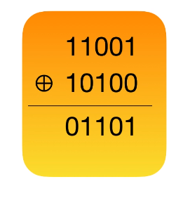
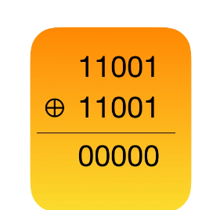
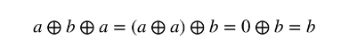

# Formula

## 位操作

1. `a << b` = `a * 2^b` or it could say move `a` to the left `b` bit
for example: `1 << 3` -> `1000`
2. 二进制下, `a << 1` 相当与 `a * 2`, `a << 1 << b` 相当与 `a * 2^b`
3. `a >> b` = `a / 2^b`
4. `aeb` = `a * 10^b`

## 异或XOR

1. js中, 异或运算符为 `^`
2. 异或操作原理是二进制数上,每位进行异或运算. 两个数相同, 则异或结果为0, 不同时候,异或结果为1 
3. 由上述, 可以得到, `0 ^ 0 = 0, 0 ^ 1 = 1`, 0和谁异或,得到就是谁
4. 同样的, 相同数异或, 结果是0 
5. 异或满足结合律和交换律 
