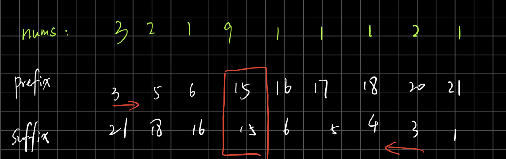
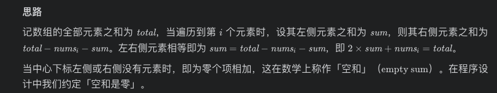

# [LeetCode ](https://leetcode-cn.com/problems/find-pivot-index/)

## Methods

### Method 1 (not best)

* `Time Complexity`: O(n)
* `Space Complexity`: O(n)
* `Intuition`:
* `Key Points`:
* `Algorithm`:

我自己的方法, 不是最佳. 算出来prefix, 和 suffix. 两个数组,某一位相等, 他就是答案


### Code

* `Code Design`:

```javascript
/**
 * @param {number[]} nums
 * @return {number}
 */
var pivotIndex = function(nums) {
    const prefixSum = [];
    const suffixSum = [];
    let prefix = 0;
    let suffix = 0;
    for (let i = 0; i < nums.length; i++) {
        // get prefixSum array
        prefix += nums[i];
        prefixSum.push(prefix);
        // get suffixSum array
        suffix += nums[nums.length - 1 - i];
        suffixSum.unshift(suffix);
    }
    for (let i = 0; i < prefixSum.length; i++) {
        if (prefixSum[i] === suffixSum[i]) return i;
    }
    return -1;
};

```

----------------------

### Method 2

* `Time Complexity`: O(n)
* `Space Complexity`: O(1)
* `Intuition`:
* `Key Points`:
* `Algorithm`:



### Code

* `Code Design`:

```javascript

var pivotIndex = function(nums) {
    const total = nums.reduce((a, b) => a + b, 0);
    let sum = 0;
    for (let i = 0; i < nums.length; i++) {
        if (2 * sum + nums[i] === total) {
            return i;
        }
        sum += nums[i];
    }
    return -1;
};
```

## Reference

[leetcode ans](https://leetcode-cn.com/problems/tvdfij/solution/zuo-you-liang-bian-zi-shu-zu-de-he-xiang-5j4r/)
